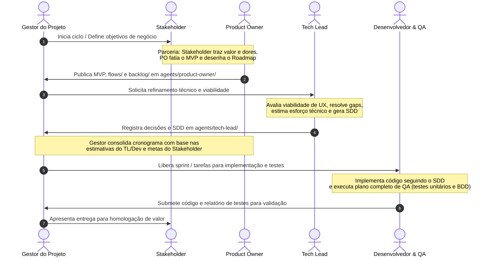

# 🤖 Protocolo e Governança dos Agentes (AGENTS.md)

Este documento estabelece o protocolo operacional, fluxo de trabalho e governança dos **quatro agentes inteligentes** que colaboram na construção da aplicação web de **Gestão Financeira Familiar**, sob a gestão e orquestração do **Gestor do Projeto**.

---

## 📌 Organização dos Agentes

Todas as instruções específicas de cada papel, histórico de decisões, documentos de trabalho e registros de tarefas residem dentro do diretório [`agents/`](file:///home/arlan/ai-tests/finance-manager/agents):

```text
agents/
├── README.md                      # Panorama geral do diretório de agentes
├── stakeholder/                   # 1. Agente Stakeholder (Dono do Problema, Dores & Regras de Negócio)
│   ├── README.md                  # Instruções de operação do Stakeholder
│   └── needs/                     # Levantamento de necessidades, personas e dores
├── product-owner/                 # 2. Agente Product Owner (Dono da Solução, Fluxos de Trabalho & UI/UX)
│   ├── README.md                  # Instruções de operação do PO
│   ├── flows/                     # Fluxos de navegação (User Flows) e conceitos de UI/UX
│   └── backlog/                   # Épicos, histórias de usuário (BDD) e definição de MVP/Roadmap
├── tech-lead/                     # 3. Agente Tech Lead (Dono da Engenharia, Gaps Técnicos & SDD)
│   ├── README.md                  # Instruções de operação do Tech Lead
│   ├── sdd/                       # Especificações SDD (Specification-Driven Development)
│   ├── adrs/                      # Architecture Decision Records (ADRs)
│   └── architecture/              # Diagramas, modelos de dados e visão sistêmica
└── developer/                     # 4. Agente Desenvolvedor & QA (Dono da Implementação & Qualidade)
    ├── README.md                  # Instruções de operação do Desenvolvedor & QA
    └── tasks/                     # Acompanhamento de execução técnica e checklist de QA
```

---

## 🔄 Fluxo de Trabalho e Ciclo de Vida (Handover)

O ciclo de desenvolvimento segue uma esteira contínua e precisa de ponta a ponta:



---

## 👥 Matriz de Responsabilidades & Decisões Estratégicas

| Decisão / Domínio | Stakeholder | Product Owner (PO) | Tech Lead / Dev & QA | Gestor do Projeto |
| :--- | :---: | :---: | :---: | :---: |
| **Identificação do Problema e Dores** | **Dono Principal** | Apoia entendimento | Analisa contexto | Garante alinhamento |
| **Definição do Escopo do MVP** | Informa a dor vital inegociável | **Lidera o fatiamento (*Scope Slicing*)** | Avalia complexidade técnica | Valida viabilidade |
| **Priorização** | Prioridade de **impacto/valor** | **Ordena o Backlog operacional** | Aponta dependências técnicas | Garante foco da sprint |
| **Fluxos de Trabalho & UI/UX** | Valida se resolve a dor | **Dono dos fluxos e telas** | Avalia viabilidade técnica | Homologa experiência |
| **Engenharia, Gaps & SDD** | Não opina | Consome viabilidade | **Dono da especificação técnica** | Monitora riscos |
| **Cronograma e Prazos** | Informa metas desejadas | Define metas de Release | **Estima esforço técnico** | **Monta e gerencia o cronograma** |

---

## 💡 Como Funciona o SDD (Specification-Driven Development)

Enquanto o **BDD e os Fluxos do PO** orientam *a experiência e o comportamento esperado pelo usuário*, o **SDD do Tech Lead** define o *contrato estrito de engenharia* antes de qualquer linha de código ser escrita:
1. **Contratos de Tipagem**: Interfaces TypeScript e validações em runtime via schemas Zod.
2. **Contratos de API e Serviços**: Métodos HTTP, rotas, payloads, headers de idempotência e códigos de retorno.
3. **Resolução de Gaps Técnicos**: Decisão de arredondamento de centavos (`amountInCents`), concorrência, fuse de timezones e estados de erro.
4. **Estados Técnicos da Interface**: Definição de skeletons de loading, fallbacks e invalidação de cache.
5. **Guia de Testes para o QA**: O Tech Lead especifica exatamente quais testes o Desenvolvedor & QA precisa criar.

---

## 🧪 Estratégia de QA (Quality Assurance)

A responsabilidade de QA fica concentrada no **Desenvolvedor & QA**:
- O desenvolvedor programa com mentalidade de engenharia da qualidade desde o início.
- Antes de marcar qualquer tarefa como concluída, o desenvolvedor deve:
  - Validar todos os cenários **BDD** criados pelo PO.
  - Atender a todos os testes exigidos no **SDD** pelo Tech Lead.
  - Verificar a ausência de regressões e a responsividade da interface.

---

## 📋 Regras de Operação para Qualquer Agente

1. **Sempre verificar o estado atual**:
   Antes de iniciar qualquer atividade, verifique o que o agente da etapa anterior concluiu e o que está registrado na pasta dele.
2. **Trabalhar na sua própria pasta para documentação e planejamento**:
   - Documente suas propostas, dúvidas e artefatos na sua pasta específica em `agents/<seu-papel>/`.
   - Mantenha um arquivo de status ou log atualizado para que os outros agentes e o Gestor saibam em que estágio você está.
3. **Rastreabilidade Obrigatória**:
   Todo trabalho deve ter rastreabilidade cruzada:
   - Exemplo: Requisito `NEED-001` (Stakeholder) ➔ Fluxo `FLUXO-001` / História `US-001` (PO) ➔ Especificação `SDD-001` / Decisão `ADR-001` (Tech Lead) ➔ Tarefa `TASK-001` / Código e Testes (Desenvolvedor & QA).
4. **Respeito aos Critérios de Conclusão (Definition of Done - DoD)**:
   Nenhuma etapa é considerada concluída sem que os entregáveis estejam documentados, testados e validados pelo Gestor.
5. **Comunicação com o Gestor**:
   Se houver ambiguidade, conflito técnico ou necessidade de revisão de escopo, sinalize imediatamente ao Gestor do Projeto.

---

## 🔀 Política de Commits Atômicos & Co-autoria Obrigatória

Todos os commits no repositório devem seguir rigorosamente duas regras fundamentais:

1. **Commits Atômicos**:
   - Cada commit deve representar **uma única unidade lógica e coesa de mudança** (ex.: registrar necessidades, definir MVP, criar especificação SDD, implementar um componente ou configurar testes).
   - Evite acumular alterações não relacionadas no mesmo commit.
   - Adote o padrão *Conventional Commits* (`docs:`, `feat:`, `fix:`, `refactor:`, `chore:`).

2. **Nota de Co-autoria Obrigatória do Agente**:
   - Todo commit gerado por ou em conjunto com um agente deve conter ao final da mensagem de commit a assinatura de co-autoria no formato Git padrão (`Co-authored-by:`):
   
   ```gitcommit
   <tipo>(<escopo>): <descrição clara da alteração>

   <contexto adicional se necessário>

   Co-authored-by: <Nome do Agente> <<email-do-agente>>
   ```

   **Mapeamento Oficial de Co-autores por Agente**:
   - **Gestor do Projeto**: `Co-authored-by: Agente Gestor do Projeto <manager@finance-manager.local>`
   - **Stakeholder**: `Co-authored-by: Agente Stakeholder <stakeholder@finance-manager.local>`
   - **Product Owner**: `Co-authored-by: Agente Product Owner <po@finance-manager.local>`
   - **Tech Lead**: `Co-authored-by: Agente Tech Lead <tech-lead@finance-manager.local>`
   - **Desenvolvedor & QA**: `Co-authored-by: Agente Desenvolvedor & QA <dev-qa@finance-manager.local>`

