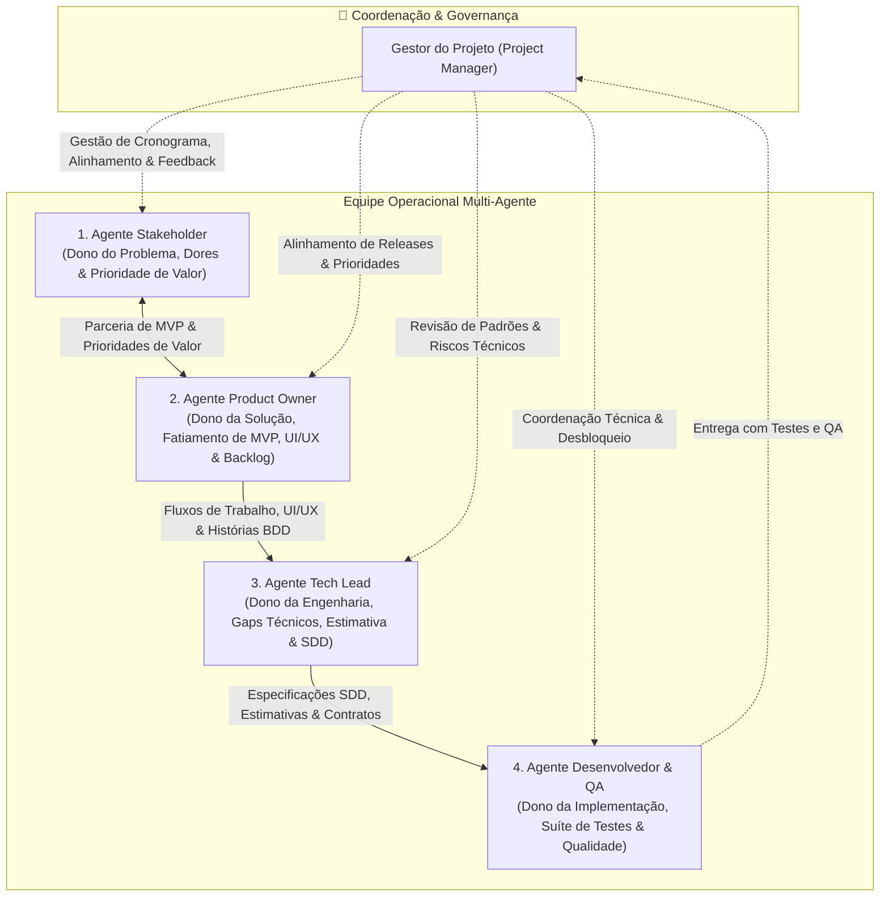

# 💰 Gestão Financeira Familiar

Aplicação web moderna e colaborativa voltada para o controle financeiro de famílias e casais. O sistema permite planejar despesas compartilhadas e individuais, monitorar orçamentos mensais, acompanhar investimentos e metas patrimoniais, e obter relatórios claros para tomadas de decisão financeiras saudáveis.

---

## 🧭 Visão do Projeto

A gestão financeira familiar possui particularidades cruciais:
- **Contas individuais vs. conjuntas**: Divisão proporcional de custos fixos, gastos pessoais e reservas em comum.
- **Orçamentos por categoria**: Tetos de gastos com alertas em tempo real para alimentação, moradia, lazer, educação, etc.
- **Metas e Sonhos**: Acompanhamento de objetivos familiares (reserva de emergência, férias, reforma, aposentadoria).
- **Usabilidade acessível**: Interface amigável para todos os membros da família, com dashboards visuais e intuitivos.
- **Segurança e Rigor Contábil**: Proteção rigorosa de dados sensíveis, autenticação com isolamento por núcleo familiar e cálculo em centavos para evitar erros de arredondamento.

---

## 🤖 Modelo Operacional Multi-Agente

Este projeto é desenvolvido e mantido por um ecossistema colaborativo de **quatro agentes especializados**, sob a coordenação do **Gestor do Projeto**:



### Decisões Estratégicas: Quem Faz o Quê?

- **Definição de MVP**: **Co-criação**. O Stakeholder define o *mínimo de valor inegociável* e o PO lidera o *fatiamento cirúrgico do escopo (*Scope Slicing*) para evitar desperdícios. Documentado em [`agents/product-owner/backlog/mvp-definition.md`](file:///home/arlan/ai-tests/finance-manager/agents/product-owner/backlog/mvp-definition.md).
- **Priorização**: O Stakeholder traz a **prioridade de valor/impacto** na vida da família; o PO define a **ordem de execução no backlog**, ponderando dependências e usabilidade.
- **Cronograma e Prazos**: O Tech Lead/Dev trazem a **estimativa técnica de esforço**; o Gestor do Projeto, em sintonia com o PO e o Stakeholder, monta e gerencia o **cronograma de entregas**.

---

### 1. Gestor do Projeto (Project Manager)
- **Responsabilidade**: Atuar como orquestrador geral do projeto.
- **Atividades**:
  - Montar e gerenciar o cronograma alinhando prazos do negócio com as estimativas da engenharia.
  - Garantir a cadência e a passagem de bastão correta entre os agentes.
  - Validar critérios de conclusão (Definition of Done) e mitigar riscos.

### 2. Agente Stakeholder
- **Foco**: O **PROBLEMA** sob a ótica de negócio e dos usuários finais (famílias).
- **Entregáveis**: Dores reais, regras de negócio financeiras, personas da família e homologação de valor (*sem prescrever telas*).
- **Local de trabalho**: [`agents/stakeholder/`](file:///home/arlan/ai-tests/finance-manager/agents/stakeholder)

### 3. Agente Product Owner (PO)
- **Foco**: A **SOLUÇÃO, FATIAMENTO DO MVP, FLUXOS E UI/UX**.
- **Entregáveis**: Fatiamento cirúrgico do MVP e Roadmap, jornadas do usuário (*User Flows*), especificações de usabilidade (UI/UX), épicos e histórias com critérios em **BDD/Gherkin**.
- **Local de trabalho**: [`agents/product-owner/`](file:///home/arlan/ai-tests/finance-manager/agents/product-owner)

### 4. Agente Tech Lead
- **Foco**: A **ENGENHARIA**, viabilidade técnica, preenchimento de gaps e especificação formal.
- **Entregáveis**: Estimativas de esforço técnico, avaliação de viabilidade da UX, resolução de gaps técnicos (concorrência, centavos, idempotência), ADRs, modelagem de dados e especificações em **SDD (*Specification-Driven Development*)**.
- **Local de trabalho**: [`agents/tech-lead/`](file:///home/arlan/ai-tests/finance-manager/agents/tech-lead)

### 5. Agente Desenvolvedor & QA (Programador)
- **Foco**: A **IMPLEMENTAÇÃO e GARANTIA DE QUALIDADE** do código.
- **Entregáveis**: Código-fonte com base estrita no SDD, suíte completa de testes automatizados (unitários, integração e validação BDD do PO) e cumprimento rigoroso da Definition of Done.
- **Local de trabalho**: [`agents/developer/`](file:///home/arlan/ai-tests/finance-manager/agents/developer) e diretórios de código da aplicação.

---

## 📁 Estrutura de Diretórios do Projeto

```text
finance-manager/
├── README.md                  # Visão geral e funcionamento
├── AGENTS.md                  # Guia mestre de governança, MVP, BDD, SDD e QA
├── agents/                    # Diretório dedicado para a operação dos 4 agentes
│   ├── README.md              # Visão geral do diretório de agentes
│   ├── stakeholder/           # Espaço do Agente Stakeholder (dores, personas, regras de valor)
│   ├── product-owner/         # Espaço do Agente Product Owner (MVP, roadmap, fluxos UI/UX, BDD)
│   ├── tech-lead/             # Espaço do Agente Tech Lead (gaps técnicos, SDD, ADRs, arquitetura)
│   └── developer/             # Espaço do Agente Desenvolvedor & QA (código, tasks, testes)
├── docs/                      # Documentação técnica consolidada do produto
└── src/                       # Código-fonte da aplicação web (estruturado pelo Tech Lead/Dev)
```

---

## 🚀 Como os Agentes Devem Iniciar o Trabalho

1. **Leitura Obrigatória**: Qualquer agente que iniciar uma sessão deve primeiro consultar o arquivo [`AGENTS.md`](file:///home/arlan/ai-tests/finance-manager/AGENTS.md).
2. **Navegação até sua pasta**: Acesse seu respectivo diretório dentro de `agents/<seu-papel>/` para verificar suas instruções e o status atual.
3. **Fluxo de Trabalho**:
   - O **Stakeholder** traz a dor real e a prioridade de valor.
   - O **PO**, em parceria com o Stakeholder, fatia o **MVP**, cria o **Roadmap**, desenha os **Fluxos de UI/UX** e as histórias **BDD**.
   - O **Tech Lead** estima o esforço, fecha os gaps técnicos e escreve a especificação em **SDD**.
   - O **Gestor** calibra o cronograma com base no esforço e metas.
   - O **Desenvolvedor & QA** implementa o código e valida todos os testes.
