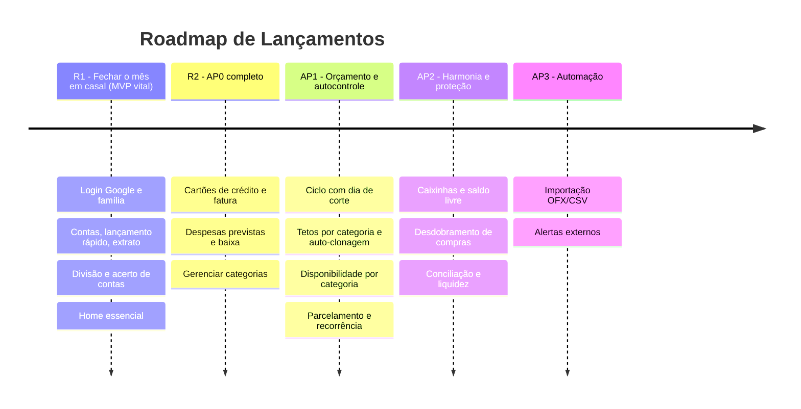

# 🎯 Definição do MVP & Roadmap de Lançamentos

*Documento do **Product Owner**, alinhado ao Stakeholder (NEED-001..012), ao Tech Lead (ADR-001..006) e ao Gestor. **Revisão 2 — 2026-10-04.***

---

## 📌 Visão do MVP (Minimum Viable Product)

### O problema central que o MVP resolve
> *"O casal/família precisa saber exatamente quanto gastou conjuntamente no mês e quem deve quanto para quem, podendo registrar despesas no celular em menos de 10 segundos, sem atritos ou discussões."*

### Estratégia de fatiamento: dois lançamentos
O escopo AP0 do Stakeholder + o split (ADR-006) é maior do que a dor vital. Para manter o MVP *mínimo*, o PO propõe **duas releases dentro do AP0**:

| Release | Incrementos | O que entrega | Backlog |
| :-- | :-- | :-- | :-- |
| **R1 — Fechar o mês em casal** *(MVP vital)* | Inc 1 + Inc 2 | Login Google, família e convite, contas, lançamento de despesa/receita, extrato, **regra de divisão, acerto de contas e registro do acerto**, transferências, home, correção de lançamentos | EN-001, US-001..013 |
| **R2 — AP0 completo** | Inc 3 | Gerenciar categorias, cartões de crédito (compra à vista, fatura e pagamento da fatura), despesas previstas pontuais (`PREVISTO` → `PAGO`, baixa com valor efetivo) | US-014, 015, 016a/b, 017a/b, 018, 019 (refinadas em 2026-10-04) |

Detalhe e ordem em [`backlog.md`](backlog.md).

### Dentro do escopo (In Scope)
**R1**
1. **Autenticação Google e onboarding** — NEED-012.
2. **Núcleo familiar** — criar família, convidar por e-mail, papéis Administrador/Membro — NEED-001.
3. **Contas bancárias** com saldo inicial e **transferências** entre contas — NEED-002.
4. **Lançamento rápido** de despesas e receitas (< 10 s no celular), com *quem pagou* e *comum vs pessoal* — NEED-001/002.
5. **Extrato** unificado com filtros — NEED-006 (fase AP0).
6. **Divisão e acerto de contas** (igualitária ou proporcional; sugestão; registro como transferência) — NEED-007 / ADR-006.
7. **Home essencial** (saldos, acerto do mês, resumo, últimos lançamentos).
8. **Correção/exclusão com trilha de auditoria.**

**R2**
9. **Cartões de crédito** (limite, fechamento, vencimento; compra à vista; fatura) — NEED-003 fase 1.
10. **Despesas previstas pontuais** e baixa em conta — NEED-004 fase 1.
11. **Gerenciar categorias.**

### Fora do MVP (R1 e R2)
- ❌ Ciclo com dia de corte, tetos por categoria, auto-clonagem, painel de disponibilidade (AP1).
- ❌ Compras parceladas e recorrência (AP1).
- ❌ Caixinhas e "Livre para gastar", desdobramento de compra, conciliação, termômetro de liquidez (AP2).
- ❌ Importação OFX/CSV, notificações WhatsApp/Telegram, metas com prazo (AP3).
- ❌ Open Finance, OCR de recibos, gráficos e exportação PDF/Excel, mesada de dependentes, multi-moeda.
- ❌ Escrita offline (ADR-004) e hospedagem de produção (ADR-005).

---

## 🗺️ Roadmap de Evolução

---

## ⚖️ Critérios de priorização

1. **Método:** MoSCoW para o corte; WSJF para a ordem; dependência dura prevalece ([`working-agreement.md`](working-agreement.md)).
2. **Must (R1/R2):** sem isso o usuário não fecha o ciclo mensal ou o fluxo fica sem sentido.
3. **Should:** reduz risco ou retrabalho, mas há contorno (correção de lançamento, pagamento de fatura).
4. **Could:** conveniências (gerenciar categorias).
5. **Won't (agora):** tudo que está em AP1+ ou no parking lot.

## 🔗 Conciliações feitas nesta revisão
| Divergência | Resolução |
| :-- | :-- |
| `cronograma-e-releases.md` põe NEED-007 no AP2; ADR-006 traz para o MVP | **Prevalece o ADR-006** (decisão do Gestor). O cronograma do Stakeholder precisa ser atualizado (ação do Stakeholder/Gestor). |
| MVP antigo não previa cartões nem previstas; AP0 do Stakeholder prevê | Mantidos, mas **separados em R2** para proteger a dor vital. |
| Período do split vs ciclo configurável (AP1) | **D-PO-03**: mês-calendário agora; `cutDay` no futuro. |
