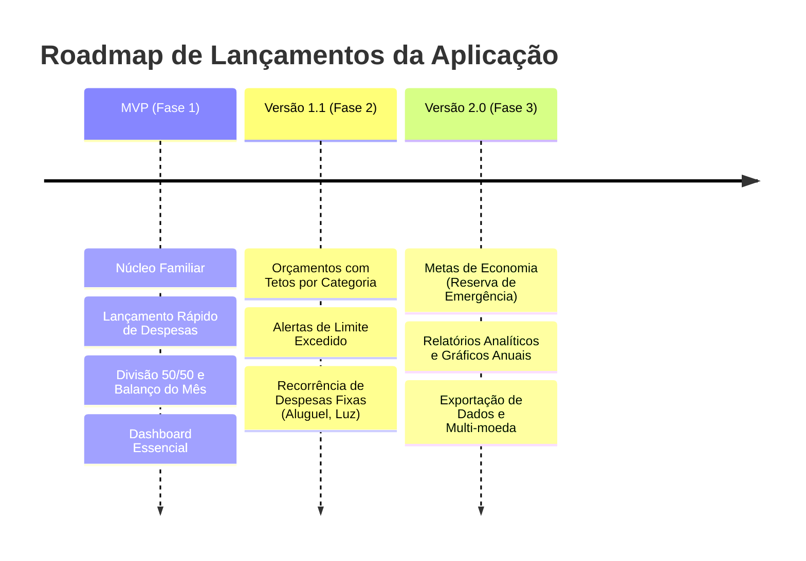

# 🎯 Definição do MVP & Roadmap de Lançamentos

*Documento co-criado pelo **Product Owner** e **Stakeholder**, com estimativas técnicas do **Tech Lead** e gestão do **Gestor do Projeto**.*

---

## 📌 Visão do MVP (Minimum Viable Product)

### O Problema Central que o MVP Resolve:
> *"O casal/família precisa saber exatamente quanto gastou conjuntamente no mês e quem deve quanto para quem, podendo registrar despesas no celular em menos de 10 segundos, sem atritos ou discussões."*

### O que ESTÁ no Escopo do MVP (In Scope):
1. **Cadastro e Gestão do Núcleo Familiar**:
   - Criação da família e cadastro dos membros principais (cônjuges/gestores).
2. **Lançamento Rápido de Transações (Quick Entry)**:
   - Registro de despesas e receitas com valor, data, pagador, categoria básica e chave "Despesa Conjunta vs Individual".
3. **Divisão de Despesas e Acerto de Contas Automático**:
   - Cálculo automático do balanço do mês (divisão 50/50 ou proporcional configurada).
   - Extrato consolidado de despesas compartilhadas.
4. **Dashboard Minimalista**:
   - Visão do saldo atual do mês e painel claro: *"Membro A deve R$ X para Membro B"*.

### O que NÃO ESTÁ no MVP (Fica para V1.1 / V2.0):
- ❌ Integração bancária automática (Open Finance / plug-ins de banco) — *Lançamento manual no MVP*.
- ❌ Gráficos complexos e relatórios exportáveis em PDF/Excel.
- ❌ Gestão de metas de longo prazo (investimentos patrimoniais, aposentadoria).
- ❌ Leitura de recibos via OCR/Câmera.
- ❌ Gestão de mesadas para dependentes infantis.

---

## 🗺️ Roadmap de Evolução

---

## ⚖️ Critérios de Priorização do Backlog (Matriz Valor x Esforço)

1. **Alta Prioridade (Must Have - MVP)**:
   - Funcionalidades essenciais sem as quais o usuário não fecha o ciclo mensal.
2. **Média Prioridade (Should Have - V1.1)**:
   - Automações que reduzem trabalho repetitivo (recorrência de contas fixas).
3. **Baixa Prioridade / Futuro (Could Have - V2.0)**:
   - Recursos analíticos e projeções financeiras.
