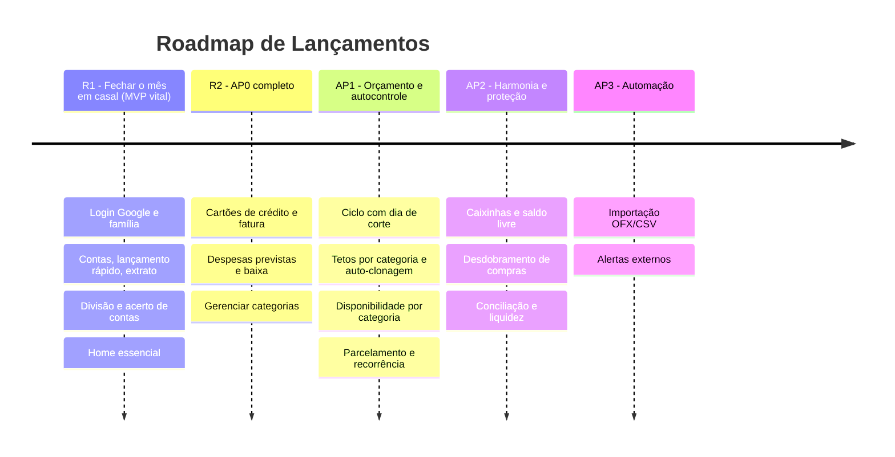
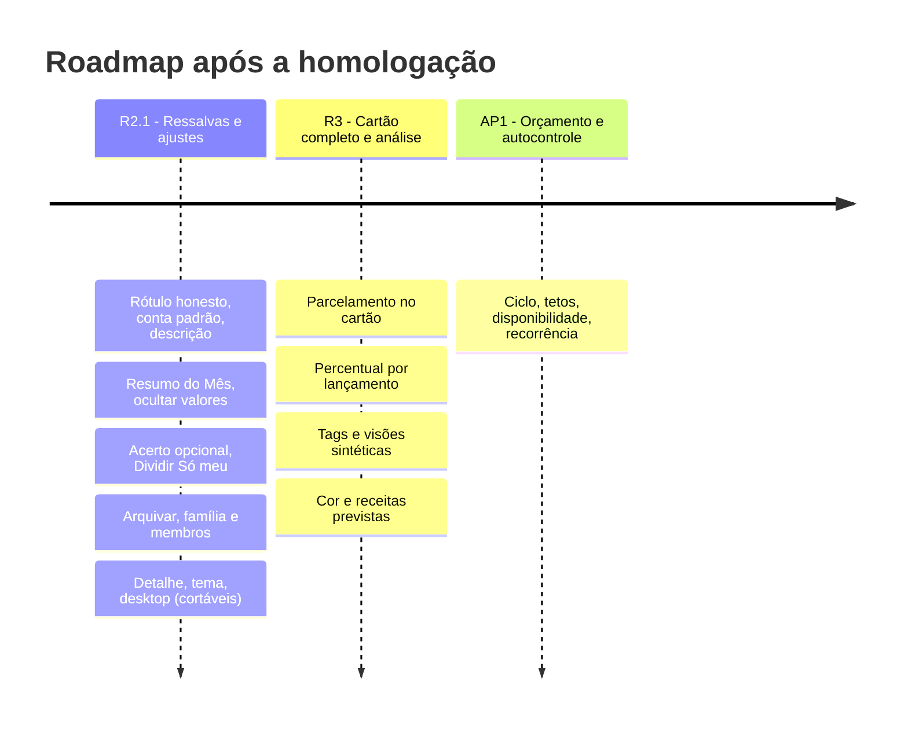

# 🎯 Definição do MVP & Roadmap de Lançamentos

*Documento do **Product Owner**, alinhado ao Stakeholder (NEED-001..023), ao Tech Lead (ADR-001..015) e ao Gestor. **Revisão 3 — 2026-10-04 (pós-homologação: R2.1 e R3).***

---

## 📌 Visão do MVP (Minimum Viable Product)

### O problema central que o MVP resolve
> *"O casal/família precisa saber exatamente quanto gastou conjuntamente no mês e quem deve quanto para quem, podendo registrar despesas no celular em menos de 10 segundos, sem atritos ou discussões."*

### Estratégia de fatiamento: dois lançamentos
O escopo AP0 do Stakeholder + o split (ADR-006) é maior do que a dor vital. Para manter o MVP *mínimo*, o PO propõe **duas releases dentro do AP0**:

| Release | Incrementos | O que entrega | Backlog |
| :-- | :-- | :-- | :-- |
| **R1 — Fechar o mês em casal** *(MVP vital)* | Inc 1 + Inc 2 | Login Google, família e convite, contas, lançamento de despesa/receita, extrato, **regra de divisão, acerto de contas e registro do acerto**, transferências, home, correção de lançamentos | EN-001, US-001..013 |
| **R2 — AP0 completo** | Inc 3 | Gerenciar categorias, cartões de crédito (compra à vista, fatura e pagamento da fatura), despesas previstas pontuais (`PREVISTO` → `PAGO`, baixa com valor efetivo) | US-014, 015, 016a/b, 017a/b, 018, 019 (refinadas em 2026-10-04) |

Detalhe e ordem em [`backlog.md`](backlog.md).

### Dentro do escopo (In Scope)
**R1**
1. **Autenticação Google e onboarding** — NEED-012.
2. **Núcleo familiar** — criar família, convidar por e-mail, papéis Administrador/Membro — NEED-001.
3. **Contas bancárias** com saldo inicial e **transferências** entre contas — NEED-002.
4. **Lançamento rápido** de despesas e receitas (< 10 s no celular), com *quem pagou* e *comum vs pessoal* — NEED-001/002.
5. **Extrato** unificado com filtros — NEED-006 (fase AP0).
6. **Divisão e acerto de contas** (igualitária ou proporcional; sugestão; registro como transferência) — NEED-007 / ADR-006.
7. **Home essencial** (saldos, acerto do mês, resumo, últimos lançamentos).
8. **Correção/exclusão com trilha de auditoria.**

**R2**
9. **Cartões de crédito** (limite, fechamento, vencimento; compra à vista; fatura) — NEED-003 fase 1.
10. **Despesas previstas pontuais** e baixa em conta — NEED-004 fase 1.
11. **Gerenciar categorias.**

### Fora do MVP (R1 e R2)
- ❌ Ciclo com dia de corte, tetos por categoria, auto-clonagem, painel de disponibilidade (AP1).
- ❌ Compras parceladas e recorrência (AP1).
- ❌ Caixinhas e "Livre para gastar", desdobramento de compra, conciliação, termômetro de liquidez (AP2).
- ❌ Importação OFX/CSV, notificações WhatsApp/Telegram, metas com prazo (AP3).
- ❌ Open Finance, OCR de recibos, gráficos e exportação PDF/Excel, mesada de dependentes, multi-moeda.
- ❌ Escrita offline (ADR-004) e hospedagem de produção (ADR-005).

---

## 🗺️ Roadmap de Evolução

---

## ⚖️ Critérios de priorização

1. **Método:** MoSCoW para o corte; WSJF para a ordem; dependência dura prevalece ([`working-agreement.md`](working-agreement.md)).
2. **Must (R1/R2):** sem isso o usuário não fecha o ciclo mensal ou o fluxo fica sem sentido.
3. **Should:** reduz risco ou retrabalho, mas há contorno (correção de lançamento, pagamento de fatura).
4. **Could:** conveniências (gerenciar categorias).
5. **Won't (agora):** tudo que está em AP1+ ou no parking lot.

## 🔗 Conciliações feitas nesta revisão
| Divergência | Resolução |
| :-- | :-- |
| `cronograma-e-releases.md` põe NEED-007 no AP2; ADR-006 traz para o MVP | **Prevalece o ADR-006** (decisão do Gestor). O cronograma do Stakeholder precisa ser atualizado (ação do Stakeholder/Gestor). |
| MVP antigo não previa cartões nem previstas; AP0 do Stakeholder prevê | Mantidos, mas **separados em R2** para proteger a dor vital. |
| Período do split vs ciclo configurável (AP1) | **D-PO-03**: mês-calendário agora; `cutDay` no futuro. |

---

## 🔁 Revisão 3 — pós-homologação: R2.1 e R3 (2026-10-04)

R1 e R2 foram **homologadas com ressalvas** e o usuário enviou 16 sugestões. O Stakeholder decidiu os pontos em aberto (Q-F01..Q-F14, aprovadas pelo Gestor). O PO fatiou assim (histórias e pontos em [`backlog.md`](backlog.md); decisões D-PO-12..32 em [`decisoes-po-r21-r3.md`](decisoes-po-r21-r3.md); perguntas ao TL em [`pedidos-ao-tech-lead-r21-r3.md`](pedidos-ao-tech-lead-r21-r3.md)):

| Release | Incremento | O que entrega | Pontos (**TL**) | Promessa |
| :-- | :-- | :-- | :-: | :-- |
| **R2.1 — Ressalvas e ajustes de baixo risco** | Inc 4 (US-022..039) | Ressalvas 1 a 4; descrição visível; **Resumo do Mês** e saldos em card recolhível; **ocultar valores**; **acerto opcional** e indicador neutro; **"Dividir" Só meu** por padrão; arquivar conta/cartão; editar família, papéis, remover membro; detalhe da transação; tema; navegação desktop; polimento | **67** (Must 40 · Should 17 · Could 10) | *"A Início responde como está o mês; o acerto é discreto e opcional; nada expõe meu dinheiro sem eu querer."* |
| **R3 — Cartão completo e análise** | Inc 5 (US-040..051, EN-002; EN-003 concluída) | **Parcelamento no cartão** (1ª entrega) e, depois da **EN-002 (Must)**, parcelado dividido por parcela; **percentual por lançamento** (migração sem mudar números; depois, 3 modos); **tags**; **visões sintéticas**; cor por conta/cartão; receitas previstas; spike de grupos | **67** (Must 24 · Should 35 · Could 8; EN-003 já entregue: 65 pendentes) | *"O cartão parcelado funciona e sei para onde foi o dinheiro."* |
| AP1 (restante) | a refinar | Ciclo, tetos, disponibilidade, recorrência (NEED-005, 006, 004 fase 2) — **logo após a R3** (Q-F12) | — | — |

**Princípios do fatiamento**
1. **A R2.1 não mexe no motor do acerto**: só corrige a explicação (rótulo), muda padrões e esconde/mostra camadas. A mudança de cálculo (percentual por lançamento) fica na **R3 com migração e regressão** (EN-002, **Must** porque a US-042 depende dela; valores 3.169,90 / cota 1.584,95 / diferença 1.149,95).
2. **Proteger os 10 segundos**: todo campo novo no lançamento é opcional e secundário (descrição visível, "Dividir" com padrão Só meu, parcelas só com cartão, tags recolhidas).
3. **Discrição por padrão**: valores ocultos em dispositivo novo; acerto neutro; "Dividir" desligado.
4. **Histórico é sagrado**: arquivar em vez de apagar, ex-membro preserva o nome, mudar a regra nunca reescreve o passado.
5. **Corte pelo fim** (revisado pelo TL, D-PO-34/35): R2.1: 039 ➔ 037 (tema) ➔ 038 (desktop) ➔ 036 (detalhe) ➔ 033 ➔ 035 ➔ 031. R3: 051 ➔ 050 ➔ 049 ➔ 046 ➔ 044 ➔ 041 ➔ 043 (a EN-002 não sai: é Must, D-PO-34).
6. **Parcelamento (decidido, D-PO-33)**: o TL estimou a US-040 em 8 e a US-042 depende da EN-002, então **não** entra na R2.1; é a 1ª entrega da R3, na ordem US-040 ➔ EN-002 ➔ US-042 ➔ US-043 ➔ US-041 (D-GES-17, Q-F14).
7. **R3 em duas entregas (D-PO-43, D-GES-23)**: **R3-A** = parcelamento (US-040a/b) + percentual por lançamento (EN-002a/b), interface inalterada, 21 pts; pausa de homologação e janela de reversão (≥ 7 dias); **R3-B** = US-042, 043, 041, 044, tags, Análise, cor e receitas previstas, 44 pts.
8. **Ordem da R2.1 (D-PO-35)**: 027 ➔ 022 ➔ 023 ➔ 024 ➔ 025 ➔ 026 ➔ 028 ➔ 029 ➔ 030 ➔ 031 ➔ 032 ➔ 033 ➔ 034 ➔ 035 ➔ 036 ➔ 037 ➔ 038 ➔ 039.

**Fora do MVP e do roadmap atual (Futuro):** IA generativa (NEED-023, depende de Q-U01 e ADR de privacidade), grupos não familiares e contas privadas (NEED-021; só o spike EN-003), exclusão da família (Q-U02), construtor de relatórios, hierarquia/cor de tags.

