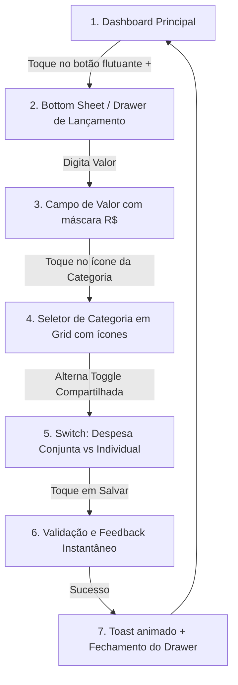

# FLUXO-001: Lançamento Rápido de Despesa Familiar (Mobile & Desktop)

- **Objetivo do Fluxo**: Permitir que qualquer membro da família registre uma despesa em menos de 10 segundos, no momento exato da compra, sem fricção.
- **Persona Principal**: Persona 2 (Lucas - Membro Colaborador em trânsito) e Persona 1 (Mariana - Gestora da Casa).
- **Rastreabilidade**: [`NEED-001`](../../stakeholder/needs/NEED-001-membros-e-responsaveis.md) · Histórias [`US-005`](../backlog/stories/US-005-lancar-despesa.md) e [`US-006`](../backlog/stories/US-006-lancar-receita.md) (substituem a antiga US-001).

---

## 1. 🧭 Diagrama de Navegação (User Flow)

---

## 2. 🎨 Especificação de Interface (UI)

### Disposição dos Componentes (Layout Mobile-First):
1. **Cabeçalho do Drawer**:
   - Título: *"Nova Despesa"*.
   - Botão discreto para alternar para *"Nova Receita"*.
2. **Área de Destaque (Herói do Formulário)**:
   - Campo de valor em fonte grande (ex: `text-4xl`), com máscara monetária automática (`R$ 0,00`).
   - Foco automático e abertura imediata do teclado numérico em dispositivos móveis.
3. **Seleção Rápida de Categorias**:
   - Grade de botões com ícones e cores temáticas: Supermercado (🛒), Moradia (🏠), Transporte (🚗), Lazer (🍕), Saúde (💊), Outros (📦).
4. **Controle de Compartilhamento Familiar**:
   - Chave seletora (*Switch*) visível: **"Dividir com a família?"** (Ligado por padrão).
   - Indicação de quem está pagando (avatar do usuário logado por padrão, com opção de trocar caso tenha sido pago por outro membro).
5. **Ação Principal**:
   - Botão largo de confirmação: **"Salvar Despesa"** (fixo no rodapé acessível pelo polegar).

---

### Revisão 2 (2026-10-04) — alinhada às NEEDs, ao ADR-006 e a US-005
- **Conta**: chip *Conta* logo abaixo do valor, pré-selecionado com a **última conta usada** pelo membro (todo lançamento pertence a uma conta, NEED-002).
- **Quem pagou?**: seletor de avatares, padrão = usuário logado. No MVP esse campo preenche *responsável pelo gasto* e *pagador* (decisão D-PO-01). O **autor do cadastro** é automático e não aparece no formulário.
- **Dividir com a família?**: o *switch* existente vira o marcador de **despesa comum vs pessoal** (RN-007.2).
- **Categorias padrão**: Supermercado, Moradia, Contas e serviços, Transporte, Saúde, Educação, Lazer e restaurantes, Outros.
- **Receita**: o alternador *Nova Receita* troca categorias por Salário / Rendimentos / Outras receitas e oculta o switch de divisão (receita não entra no rateio no MVP).

---

## 3. ✨ Experiência do Usuário (UX & Micro-interações)

- **Fricção Mínima**: Campos secundários (como notas detalhadas, anexo de comprovante ou alteração de data retroativa) ficam recolhidos em um botão *"Mais detalhes..."* para não poluir o lançamento ágil.
- **Feedback Háptico e Visual**: Leve vibração (em navegadores mobile compatíveis) e animação sutil de sucesso ao concluir o salvamento.
- **Sincronização em Background**: O extrato atualiza imediatamente na tela sem recarregar a página (otimização de cache).

---

### Revisão 3 (2026-10-04) — compra no cartão (R2, US-016)
- O *chip* **Conta** vira **"Pagar com"** (contas e cartões; padrão = último meio usado). No modo **Receita** continua só com contas. Ao escolher um cartão, aparecem a dica "Entra na fatura de out/2026 · fecha 25/10" e o "Disponível" do cartão; compra acima do limite pede *Confirmar mesmo assim*. Detalhes em [FLUXO-004](FLUXO-004-cartao-e-fatura.md). O atalho "Gerenciar categorias" (US-014) fica no fim da grade de categorias.
