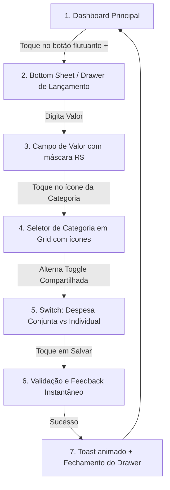

# FLUXO-001: Lançamento Rápido de Despesa Familiar (Mobile & Desktop)

- **Objetivo do Fluxo**: Permitir que qualquer membro da família registre uma despesa em menos de 10 segundos, no momento exato da compra, sem fricção.
- **Persona Principal**: Persona 2 (Lucas - Membro Colaborador em trânsito) e Persona 1 (Mariana - Gestora da Casa).
- **Rastreabilidade**: [`[NEED-001]`](file:///home/arlan/ai-tests/finance-manager/agents/stakeholder/needs/needs-overview.md#need-001-registro-e-classificao-gil-de-transaes) e [`[US-001]`](file:///home/arlan/ai-tests/finance-manager/agents/product-owner/backlog/backlog.md#us-001-cadastro-e-gesto-de-transaes-financeiras).

---

## 1. 🧭 Diagrama de Navegação (User Flow)

---

## 2. 🎨 Especificação de Interface (UI)

### Disposição dos Componentes (Layout Mobile-First):
1. **Cabeçalho do Drawer**:
   - Título: *"Nova Despesa"*.
   - Botão discreto para alternar para *"Nova Receita"*.
2. **Área de Destaque (Herói do Formulário)**:
   - Campo de valor em fonte grande (ex: `text-4xl`), com máscara monetária automática (`R$ 0,00`).
   - Foco automático e abertura imediata do teclado numérico em dispositivos móveis.
3. **Seleção Rápida de Categorias**:
   - Grade de botões com ícones e cores temáticas: Supermercado (🛒), Moradia (🏠), Transporte (🚗), Lazer (🍕), Saúde (💊), Outros (📦).
4. **Controle de Compartilhamento Familiar**:
   - Chave seletora (*Switch*) visível: **"Dividir com a família?"** (Ligado por padrão).
   - Indicação de quem está pagando (avatar do usuário logado por padrão, com opção de trocar caso tenha sido pago por outro membro).
5. **Ação Principal**:
   - Botão largo de confirmação: **"Salvar Despesa"** (fixo no rodapé acessível pelo polegar).

---

## 3. ✨ Experiência do Usuário (UX & Micro-interações)

- **Fricção Mínima**: Campos secundários (como notas detalhadas, anexo de comprovante ou alteração de data retroativa) ficam recolhidos em um botão *"Mais detalhes..."* para não poluir o lançamento ágil.
- **Feedback Háptico e Visual**: Leve vibração (em navegadores mobile compatíveis) e animação sutil de sucesso ao concluir o salvamento.
- **Sincronização em Background**: O extrato atualiza imediatamente na tela sem recarregar a página (otimização de cache).
