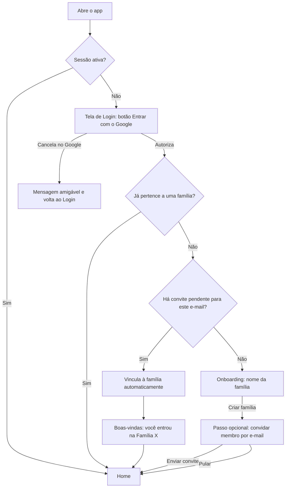

# FLUXO-002: Entrada, Criação da Família e Convite do Cônjuge

- **Objetivo**: Do primeiro clique até a família estar montada com dois membros, em poucos minutos e **sem digitar senha**.
- **Personas**: Mariana (Gestora Familiar, cria a família) e Lucas (Membro Colaborador, é convidado).
- **Rastreabilidade**: `NEED-012`, `NEED-001` · Histórias `US-001`, `US-002`, `US-003` · `ADR-002`.

---

## 1. 🧭 Diagrama de Navegação

---

## 2. 🎨 Especificação de Interface

### Tela de Login
- Logo + frase de valor ("Suas finanças em família, sem briga").
- **Um único botão** grande: *Entrar com o Google*. Sem campos de e-mail/senha.
- Texto de apoio curto sobre privacidade ("Usamos apenas seu nome, e-mail e foto").

### Onboarding (primeiro acesso, sem convite)
- Saudação com **nome e foto** vindos do Google.
- Campo único: **Nome da família** (pré-preenchido com "Família {último sobrenome}").
- Botão: *Criar família*.
- Passo seguinte (pulável): campo **E-mail Google do(a) parceiro(a)** + botão *Enviar convite* / link *Fazer depois*.

### Gestão de membros (tela *Família*)
- Lista de membros com avatar, nome, e-mail e papel.
- Seção *Convites pendentes* com e-mail, validade e ação *Cancelar convite*.
- Botão *Convidar membro* abre drawer com e-mail e papel (padrão *Membro*).

---

## 3. ✨ UX e Estados
- **Carregando**: skeleton na tela enquanto a sessão é resolvida (sem "flash" da tela de login).
- **Vazio**: família com um só membro mostra convite destacado ("Convide quem divide as contas com você").
- **Erro**: mensagens em português, sem jargão técnico, sempre com saída (tentar de novo / voltar).
- **Convite aberto com outro e-mail**: tela explicando que o convite é para outro endereço, com ação *Entrar com outra conta*.
- **Acessibilidade**: botão do Google com rótulo textual; foco visível; contraste AA.

## Revisão 2 (2026-10-04) — R2.1
- Novo **passo opcional** após criar a família: "Como vocês dividem as despesas?" (padrão: acerto ligado; opção "Só controlar, sem dividir"). Ver [FLUXO-009](FLUXO-009-acerto-opcional.md) e [US-028](../backlog/stories/US-028-acerto-de-contas-opcional.md).
- Convite pendente ganha "Copiar link" e "Reenviar e-mail" ([US-039](../backlog/stories/US-039-polimento-da-homologacao.md)) e o aviso da conta Google do mesmo e-mail antes de enviar.
- Editar a família, papéis, remover membro e sair: [FLUXO-011](FLUXO-011-familia-e-membros.md).
