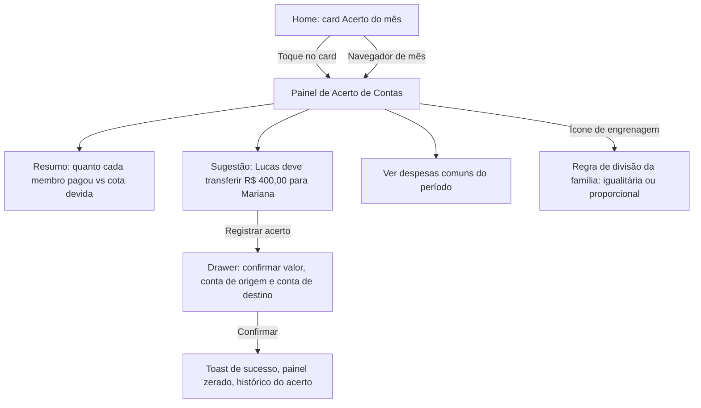

# FLUXO-003: Acerto de Contas do Mês (Split Familiar)

- **Objetivo**: Em 3 segundos entender *"quem deve quanto a quem"* neste mês e, com 1 toque, registrar o acerto.
- **Personas**: Mariana (confere o balanço) e Lucas (faz a transferência).
- **Rastreabilidade**: `NEED-007` (RN-007.1..3) · Histórias `US-008`, `US-009`, `US-010`, `US-011` · `ADR-006`.

---

## 1. 🧭 Diagrama de Navegação

---

## 2. 🎨 Especificação de Interface

### Painel de Acerto
1. **Seletor de mês** no topo (padrão: mês corrente).
2. **Faixa de resultado (herói)**: frase única e grande.
   - Desequilíbrio: *"Lucas deve R$ 400,00 para Mariana"*.
   - Equilibrado: *"Tudo certo neste mês ✅"*.
3. **Cartões por membro**: avatar, *Pagou* (R$), *Cota devida* (R$) e *Diferença* (positiva = tem a receber, negativa = deve).
4. **Botão primário**: *Registrar acerto* (oculto quando equilibrado).
5. **Lista expansível**: despesas comuns do período, com quem pagou e valor.
6. **Rodapé informativo**: "Despesas pessoais não entram na divisão".

### Drawer *Registrar acerto*
- Valor sugerido pré-preenchido e editável (acerto parcial permitido).
- Conta de origem (do membro devedor) e conta de destino (do credor).
- Botão *Confirmar acerto*.

---

## 3. ✨ UX e Estados
- **Vazio** (sem despesas comuns): "Nenhuma despesa comum neste mês. Marque despesas como *Dividir com a família* para vê-las aqui."
- **Um só membro na família**: explica que o acerto exige pelo menos dois membros e leva ao convite.
- **Mês já acertado**: faixa verde + histórico do acerto (quem transferiu, quanto, quando).
- **Acerto parcial**: faixa mostra o saldo remanescente.
- **Valores sempre em BRL** com duas casas, derivados de centavos inteiros.

## Revisão 2 (2026-10-04) — R2.1
- O acerto passa a ser **opcional por família** e a viver na **aba Acerto**; na Home vira uma **linha neutra** no Resumo do Mês ([FLUXO-006](FLUXO-006-home-resumo-do-mes.md), [FLUXO-009](FLUXO-009-acerto-opcional.md)). Linguagem neutra ("valor a acertar", "diferença do mês") em lugar de "deve" ([US-028](../backlog/stories/US-028-acerto-de-contas-opcional.md)).
- O painel mostra o **rótulo honesto da regra** com vigência e percentual ponderado ([US-022](../backlog/stories/US-022-rotulo-honesto-da-regra-de-divisao.md)), a linha "N despesas Só meu neste mês" ([US-030](../backlog/stories/US-030-dividir-desligado-por-padrao.md)) e a tela da regra com prévia de impacto e sugestão pela renda ([US-031](../backlog/stories/US-031-previa-de-impacto-da-regra-e-sugestao-pela-renda.md)). Em meses encerrados, na R3, o aviso de revisão ([US-044](../backlog/stories/US-044-lembrar-dividir-por-categoria-e-revisao-do-mes.md)).
