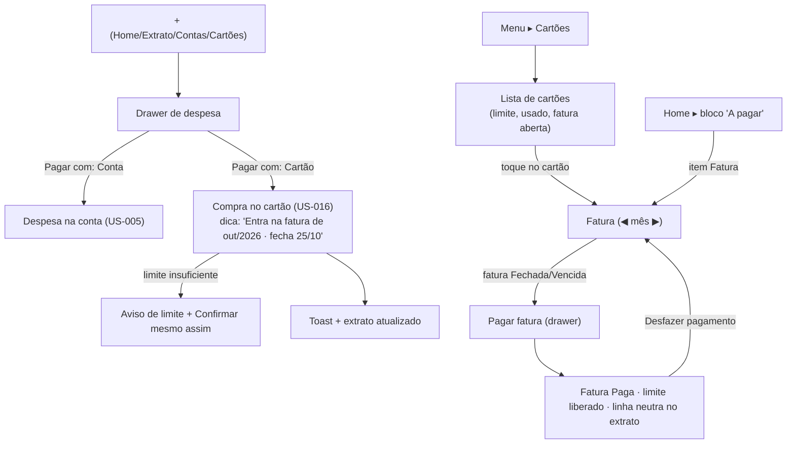

# FLUXO-004: Cartão de Crédito, Compra e Fatura (Mobile & Desktop)

- **Objetivo**: separar o gasto no cartão do saldo das contas, mostrar "quanto devo e quando" e permitir pagar a fatura sem criar despesa duplicada.
- **Personas**: Mariana (titular do cartão compartilhado) e Lucas (usa o cartão no dia a dia).
- **Rastreabilidade**: [NEED-003](../../stakeholder/needs/NEED-003-cartoes-de-credito-e-parcelamentos.md) · Histórias [US-015](../backlog/stories/US-015-cadastrar-cartao-de-credito.md), [US-016](../backlog/stories/US-016-compra-a-vista-no-cartao.md), [US-016b](../backlog/stories/US-016b-corrigir-compra-no-cartao-e-filtro.md), [US-017](../backlog/stories/US-017-ver-fatura-do-cartao.md), [US-017b](../backlog/stories/US-017b-pagar-a-fatura.md) · estende [FLUXO-001](FLUXO-001-lancamento-rapido.md) (rev. 3).

## 1. Diagrama de navegação



## 2. Ciclo da fatura (regra visual e de negócio)

```text
Cartão: fecha dia 25 · vence dia 5 do mês seguinte
   26/09 ───────────── compras ─────────────► 25/10 (fecha) ───── 05/11 (vence)
   └────────── Fatura de out/2026: ABERTA ───┘└─ FECHADA ──┴─ VENCIDA se não paga ─┘
   compra de 15/10 → out/2026      compra de 25/10 → out/2026      compra de 26/10 → nov/2026
Situação: Aberta (hoje ≤ fechamento) · Fechada (hoje > fechamento, não paga) · Vencida (hoje > vencimento) · Paga
```

## 3. Especificação de interface

1. **Drawer de despesa (rev. 3)**: o *chip* "Conta" vira **"Pagar com"** (seções *Contas* e *Cartões*; cartão mostra "Disponível R$ …"). Ao escolher cartão: dica da fatura de destino e do limite. Nada mais muda (valor, categoria, quem pagou, dividir, mais detalhes).
2. **Lista de cartões**: *card* com nome, titular, **barra de limite** (usado/disponível), ciclo ("Fecha dia 25 · vence dia 5 do mês seguinte") e **fatura aberta** com total. Vazio: "Cadastre seu primeiro cartão".
3. **Tela da fatura**: topo com seletor ◀ **out/2026** ▶; *chip* de situação (Aberta = neutro; Fechada = atenção; **Vencida = alerta**; Paga = sucesso, sempre com texto); **total** em fonte grande; datas de fechamento e vencimento; **subtotal por membro**; lista de compras. CTA **"Pagar fatura"** só em Fechada/Vencida com total > 0.
4. **Pagar fatura**: *drawer* com valor somente leitura, conta de origem (saldo ao lado), data (Mais detalhes), aviso de conta negativa, "Confirmar pagamento".
5. **Extrato**: compra no cartão mostra o cartão e a fatura onde seria a conta, marcador "Cartão"; o pagamento da fatura é uma linha **neutra** (setas, não verde nem vermelha) que **não soma** em receitas/despesas.

## 4. Coerência com o resto do produto (decisão do PO)
| Evento | Saldo das contas | Limite do cartão | Despesas do mês / acerto | Extrato |
| :-- | :-: | :-: | :-: | :-- |
| Compra no cartão | não muda | **consome** | **entra** (pela data da compra) | linha de despesa com cartão |
| Fechamento da fatura | não muda | não muda | não muda | — |
| **Pagamento da fatura** | **debita a conta** | **libera** | **não entra** (já contado na compra) | linha neutra |
| Desfazer pagamento | volta | volta a consumir | não muda | linha desfeita (histórico) |
| Transferência entre contas (US-010) | redistribui | — | não entra | duas linhas ligadas |

O pagamento da fatura é, portanto, um movimento de caixa **como uma transferência** (sai de uma conta e quita uma dívida, sem criar despesa), e a compra é uma despesa **como qualquer outra**, só que sem conta de origem até a fatura ser paga.

## 5. Estados e acessibilidade
Skeleton nos cards e na fatura; vazio por cartão/fatura; erro de leitura com "Tentar de novo"; sem conexão (padrão SDD-000 §7); situação sempre com **texto além da cor**; alvos ≥ 44 px; 375 px sem rolagem horizontal.

## 6. Histórico
- 2026-10-04 — Criado no refinamento da R2.
