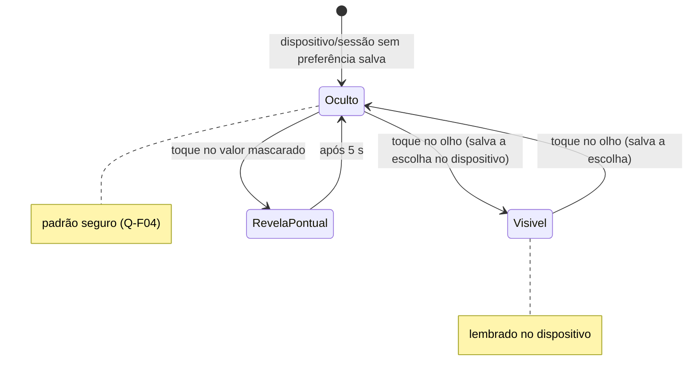

# FLUXO-007: Ocultar valores na tela (Mobile & Desktop)

- **Objetivo**: usar o app em público (rua, transporte, mercado) sem expor saldos e dívidas, com um toque e sem perder o hábito de lançar.
- **Personas**: Lucas (membro em trânsito) e Mariana (gestora da casa).
- **Rastreabilidade**: [NEED-014](../../stakeholder/needs/NEED-014-ocultar-valores-na-tela.md), [NEED-022](../../stakeholder/needs/NEED-022-preferencias-de-uso-e-ergonomia.md) (RN-022.1) · História [US-027](../backlog/stories/US-027-ocultar-valores.md) · D-PO-15.

## 1. Diagrama de estados



## 2. Especificação de interface
1. **Controle**: ícone de olho no **cabeçalho** de todas as telas (mobile e desktop), alvo ≥ 44 px, com rótulo acessível "Mostrar valores" / "Ocultar valores". Dica: "Oculta os valores na tela. Não protege seus dados." (RN-014.2, sem prometer segurança).
2. **Máscara**: `R$ •••••` de **largura fixa** (não revela a ordem de grandeza); sinal negativo **não** aparece oculto.
3. **O que é mascarado** (todo valor de **leitura**): saldos, Resumo do Mês, acerto, faturas e limites, extrato, previstas, detalhe, contas e cartões, totais das visões (R3).
4. **O que permanece**: percentuais ("58% / 42%", "75%"), quantidades (parcelas "3/10", "3 compras"), datas, nomes e descrições (RN-014.4).
5. **Entrada**: o campo de valor no lançamento **mostra o que o usuário digita**; o aviso de sucesso **não repete o valor** com os valores ocultos.
6. **Revelar pontualmente**: tocar num valor mascarado o mostra por 5 s e volta a ocultar (acessível por teclado: Enter/Espaço).
7. **Alertas** continuam ("A conta de origem ficará negativa"), **sem** o valor quando ocultos.
8. **Leitor de tela**: o valor oculto é lido como "valor oculto".

## 3. Regras
- **Padrão** em dispositivo/sessão sem preferência: **oculto**; depois **lembra a última escolha** no dispositivo (Q-F04); outro usuário no mesmo dispositivo começa oculto.
- A tela **nunca pisca** o valor real antes de aplicar a preferência (renderiza mascarado e revela depois).
- Sem armazenamento disponível: fica oculto e o controle funciona só na sessão.
- A preferência não altera dados nem cálculos (RN-014.3).

## 4. Wireframe textual (Home, mobile)

```text
 Valores ocultos (padrão)                 Valores visíveis
┌───────────────────────────┐            ┌───────────────────────────┐
│ Família Silva  🙈  (M)    │            │ Família Silva  👁  (M)     │
│ Resultado do mês R$ ••••• │   toque    │ Resultado do mês R$ 3.800 │
│ Saldo previsto   R$ ••••• │   ──────►  │ Saldo previsto  R$ 8.631,70│
│ Acerto do mês: R$ ••••• … │            │ Acerto do mês: R$ 380,00… │
└───────────────────────────┘            └───────────────────────────┘
```

## 5. Histórico
- 2026-10-04 — Criado no refinamento da R2.1.
