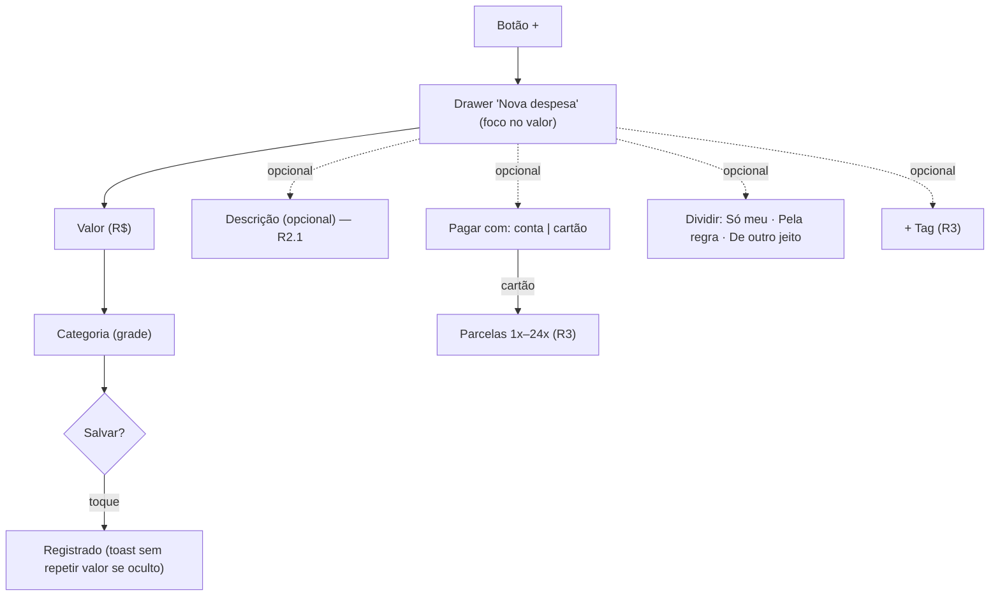

# FLUXO-008: Lançar despesa — descrição, "dividir", parcelas e tags (R2.1 e R3)

- **Objetivo**: manter a meta de **< 10 s** (4 interações: valor, categoria, salvar) mesmo com os novos campos, que são **opcionais e secundários**.
- **Personas**: Lucas (em trânsito) e Mariana (gestora).
- **Rastreabilidade**: [FLUXO-001](FLUXO-001-lancamento-rapido.md) (revisões 1 a 3) · [NEED-022](../../stakeholder/needs/NEED-022-preferencias-de-uso-e-ergonomia.md), [NEED-018](../../stakeholder/needs/NEED-018-divisao-opcional-e-por-lancamento.md), [NEED-003](../../stakeholder/needs/NEED-003-cartoes-de-credito-e-parcelamentos.md), [NEED-013](../../stakeholder/needs/NEED-013-tags-livres.md) · Histórias [US-024](../backlog/stories/US-024-descricao-visivel-e-opcional.md), [US-030](../backlog/stories/US-030-dividir-desligado-por-padrao.md), [US-040](../backlog/stories/US-040-compra-parcelada-no-cartao.md), [US-043](../backlog/stories/US-043-dividir-no-lancamento-tres-modos.md), [US-044](../backlog/stories/US-044-lembrar-dividir-por-categoria-e-revisao-do-mes.md), [US-045](../backlog/stories/US-045-tags-livres-no-lancamento.md) · D-PO-16, D-PO-20, D-PO-25, D-PO-28.
- Este fluxo **estende** o FLUXO-001 (revisão 4); o FLUXO-001 permanece como referência dos conceitos básicos.

## 1. Diagrama



## 2. Disposição do formulário (de cima para baixo)

| # | Campo | Release | Observação |
| :-: | :--- | :-: | :--- |
| 1 | **Valor** (foco automático) | R1 | máscara BRL; valor total |
| 2 | **Categoria** (grade) | R1 | obrigatória |
| 3 | **Descrição (opcional)** | **R2.1** | **visível**, 1 linha, vazio assume a categoria; **não** recebe foco |
| 4 | **Pagar com** (conta ou cartão) | R1/R2 | padrão: última usada |
| 5 | **Parcelas** (só com cartão) | **R3** | 1x padrão; prévia "10x de R$ 250,00 · 1ª na fatura de nov/2026" |
| 6 | **Quem pagou** | R1 | avatares; padrão logado |
| 7 | **Dividir** (só com acerto ligado e 2+ membros) | **R2.1** (interruptor) / **R3** (3 modos) | padrão **Só meu** |
| 8 | **+ Tag** | **R3** | recolhido; chips; sugestões |
| 9 | **Mais detalhes** (data, observação) | R1 | recolhido |
| 10 | **Salvar Despesa** | R1 | fixo no rodapé |

### Wireframe textual (R2.1, mobile 375 px)

```text
┌─────────────────────────────────────────────┐
│ Nova despesa                 [Nova receita] │
│              R$ 150,50   (foco, fonte grande)│
├─────────────────────────────────────────────┤
│  (🛒)  (🏠)  (🧾)  (🚗)  (💊)  (🎓)  (🍕)  (📦) │
│  Categoria: Supermercado ✓                  │
│ ┌─────────────────────────────────────────┐ │
│ │ Descrição (opcional)                    │ │  ← R2.1: visível
│ └─────────────────────────────────────────┘ │
│  Pagar com:  [ Nubank Conjunta ▾ ]          │
│  Quem pagou: (Lucas ✓) (Mariana)            │
│  Dividir com a família   ○──  Só meu        │  ← R2.1: desligado por padrão
│  ▸ Mais detalhes                            │
│ ┌─────────────────────────────────────────┐ │
│ │            Salvar Despesa               │ │
│ └─────────────────────────────────────────┘ │
└─────────────────────────────────────────────┘
```

### Variações (R3)
```text
Pagar com: [ Nubank Lucas (cartão) ▾ ]   Entra na fatura de nov/2026 · fecha 25/11
Parcelas:  [ 10x ▾ ]  10x de R$ 250,00 · 1ª na fatura de nov/2026
Divisão:   ( Só meu | Pela regra (50/50) | De outro jeito )   ← controle segmentado
           De outro jeito: Lucas [ 100 ]%  Mariana [ 0 ]%  Soma: 100% ✓
+ Tag      [viagem-nordeste ×] [ferias ×]   (sugestões ao digitar)
```

## 3. Regras de interface
- **Quatro interações** para o caso comum **Só meu**: valor, categoria, salvar (e o foco já está no valor). A descrição **não é obrigatória** e **não rouba foco**.
- **"Dividir"** some com o acerto desligado ou com um único membro; **nunca lembra** a última escolha (o padrão é sempre Só meu), exceto a categoria que "divide por padrão" (US-044, R3).
- **Parcelado** só aparece com cartão; até a US-042 existir, "Dividir" mostra "Disponível em breve" quando parcelas > 1.
- **Erros** de campo somem ao corrigir o valor (US-039), sem saltar o layout.
- **Valores ocultos**: o campo mostra o que o usuário digita; o toast não repete o valor.

## 4. Estados
Carregando contas/cartões (skeleton do seletor); sem contas nem cartões ("Cadastre uma conta para começar"); duplo clique protegido (Idempotency-Key); falha de rede ("Sem conexão. Seus dados continuam na tela, tente de novo.").

## 5. Histórico
- 2026-10-04 — Criado no refinamento da R2.1/R3 (revisão 4 do FLUXO-001).
