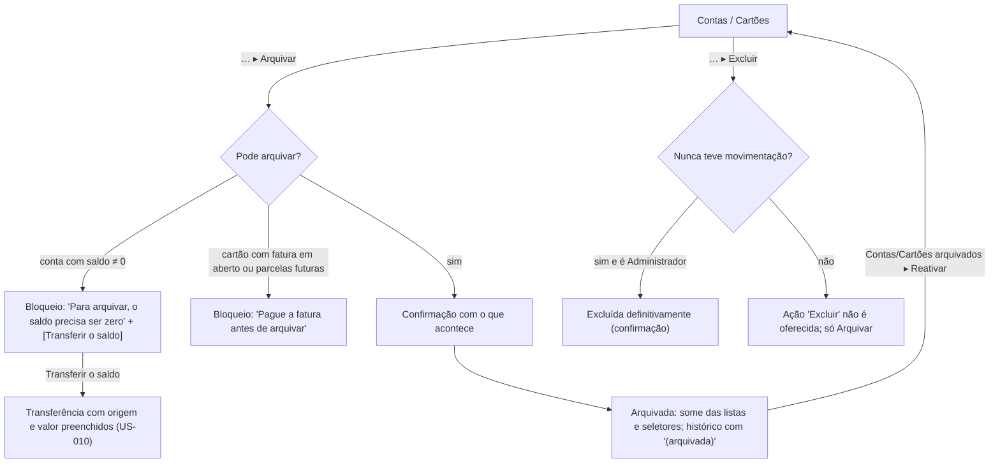

# FLUXO-010: Arquivar, reativar e excluir conta ou cartão

- **Objetivo**: permitir limpar o cadastro sem perder o histórico financeiro e sem fazer o saldo "sumir".
- **Rastreabilidade**: [NEED-020](../../stakeholder/needs/NEED-020-ciclo-de-vida-de-contas-familia-e-membros.md) (RN-020.1..3) · Histórias [US-032](../backlog/stories/US-032-arquivar-reativar-e-excluir-conta.md), [US-033](../backlog/stories/US-033-arquivar-e-reativar-cartao.md) · Q-F11 · D-PO-17.

## 1. Diagrama

## 2. Especificação de interface
1. **Menu "…" rotulado** em cada linha ("Editar", "Arquivar", "Excluir" quando elegível). Nada escondido.
2. **Bloqueios com motivo e próximo passo** (nunca mensagem genérica): conta com saldo → botão "Transferir o saldo" (leva à transferência com origem e valor); cartão com fatura → "Ver fatura".
3. **Seção recolhida "Contas arquivadas (N)"** no fim da lista, com "Reativar". Idem cartões.
4. **No histórico** (Extrato, faturas, acertos) a origem arquivada aparece como **"Poupança (arquivada)"**.
5. **Arquivadas** não entram no total do card "Saldos das contas" nem nos seletores "Pagar com" / transferência / baixa.
6. **Permissões**: qualquer membro arquiva e reativa; **só o Administrador exclui** (sem movimentação).
7. Conflito de versão: "Esta conta foi alterada por X. Recarregue para continuar."

## 3. Estados
Skeleton, vazio de arquivadas (seção oculta), erro de rede (padrão "Sem conexão..."), duplo clique protegido.

## 4. Histórico
- 2026-10-04 — Criado no refinamento da R2.1.
