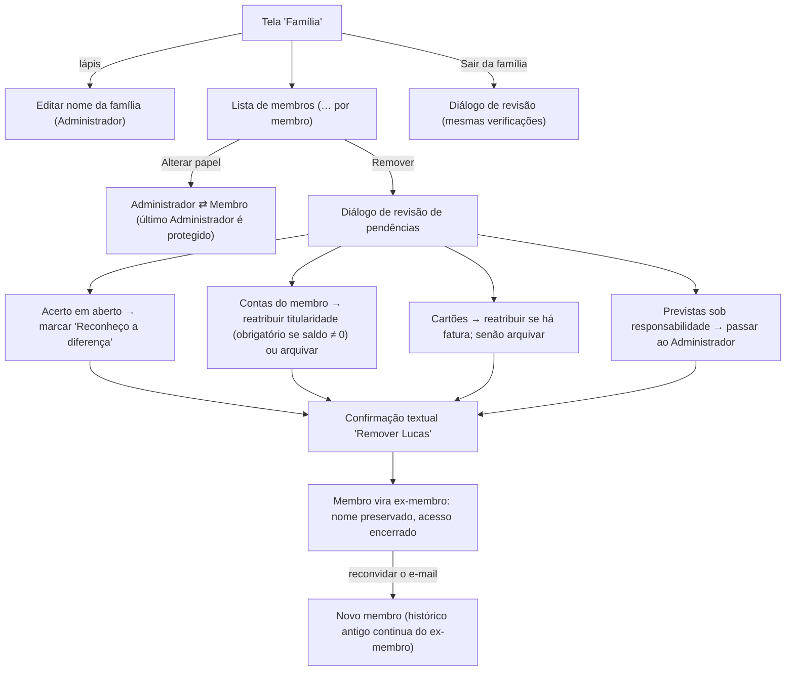

# FLUXO-011: Editar família, papéis, remover membro e sair

- **Objetivo**: manter o cadastro da família atualizado sem nunca perder histórico; encerrar o acesso de quem saiu da casa com segurança.
- **Personas**: Mariana (Administradora), Lucas (Membro).
- **Rastreabilidade**: [NEED-020](../../stakeholder/needs/NEED-020-ciclo-de-vida-de-contas-familia-e-membros.md) (RN-020.1, 020.4..7) · Histórias [US-034](../backlog/stories/US-034-editar-familia-e-papeis.md), [US-035](../backlog/stories/US-035-remover-membro-e-sair-da-familia.md) · [FLUXO-002](FLUXO-002-onboarding-e-convite.md) · Q-F07 · D-PO-18.

## 1. Diagrama

## 2. Especificação de interface
1. **Tela "Família"**: cartão do nome (com "Editar nome" para o Administrador); lista de membros com avatar, papel e "…" (Alterar papel, Remover); convites pendentes (com "Copiar link" e "Reenviar", US-039); rodapé "Sair da família".
2. **Revisão de pendências** (diálogo em 2 etapas): lista **só o que existe** ("1 conta de Lucas será arquivada", "1 despesa prevista será passada para você", "Há R$ 380,00 a acertar entre vocês"); seletores para reatribuir; o botão destrutivo **só habilita** com pendências resolvidas.
3. **Confirmação textual** ("Remover Lucas") para evitar toque acidental; botão em cor destrutiva com texto.
4. **Sair da família**: mesmas verificações; após sair, tela "Você saiu da Família Silva" com "Criar ou entrar em uma família".
5. **Bloqueios**: último Administrador não sai/é rebaixado ("Promova outro membro antes"); único membro não sai.
6. **No histórico**: "Pago por Lucas (ex-membro)"; cotas e acertos passados intactos.

## 3. Estados
Skeleton; erro de rede; conflito de versão ("A família foi alterada por X"); sessão do removido encerrada: ao atualizar vê "Seu acesso a esta família foi encerrado".

## 4. Fora de escopo
Excluir a família (RN-020.6; pergunta Q-U02 ao usuário); retenção de dados de ex-membros.

## 5. Histórico
- 2026-10-04 — Criado no refinamento da R2.1.
