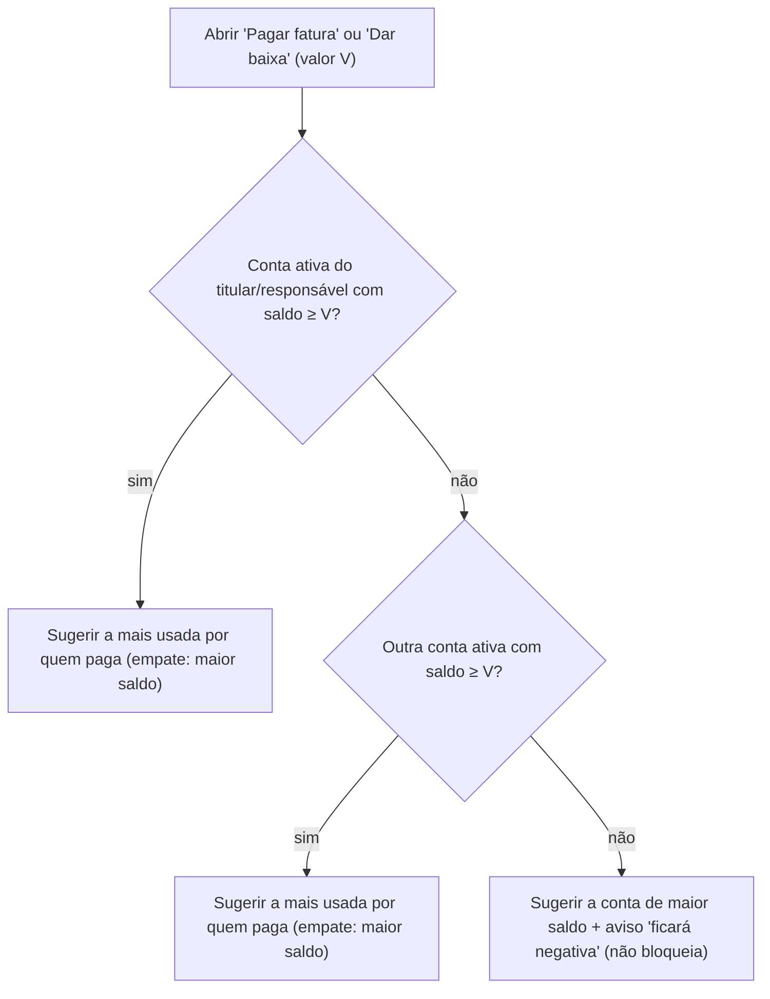

# FLUXO-012: Conta de origem padrão nos pagamentos (fatura e baixa)

- **Objetivo**: ao pagar fatura ou dar baixa, a conta sugerida já ser a certa, sem o aviso desnecessário de saldo negativo.
- **Rastreabilidade**: Homologação achado 3 · [NEED-004](../../stakeholder/needs/NEED-004-despesas-previstas-e-recorrentes.md) (RN-004.x), [NEED-003](../../stakeholder/needs/NEED-003-cartoes-de-credito-e-parcelamentos.md) · História [US-023](../backlog/stories/US-023-conta-de-origem-padrao-inteligente.md) · [FLUXO-004](FLUXO-004-cartao-e-fatura.md), [FLUXO-005](FLUXO-005-despesas-previstas.md) · D-PO-19.

## 1. Algoritmo de sugestão (decisão do PO)

- **Nunca** a "última conta usada" se ela ficar negativa havendo alternativa suficiente.
- Contas arquivadas ([US-032](../backlog/stories/US-032-arquivar-reativar-e-excluir-conta.md)) são ignoradas.
- O **lançamento de despesa** (FLUXO-008) mantém "última conta usada", porque ali o usuário está gastando e escolhe o meio.

## 2. Interface
- Campo **"Pagar com"** mostra a conta sugerida e uma linha de motivo ("Conta do titular com saldo suficiente" / "Outra conta com saldo suficiente" / "Nenhuma conta cobre o valor").
- A lista abre com **saldo** de cada conta e a marcação **"saldo insuficiente"** nas que não cobrem V (texto, não só cor).
- Alterar o valor **antes** de escolher a conta recalcula a sugestão; **depois** de escolher manualmente, não troca sozinha.
- Valores ocultos: saldos mascarados; "saldo insuficiente" permanece.

## 3. Histórico
- 2026-10-04 — Criado no refinamento da R2.1 (ressalva 3).
