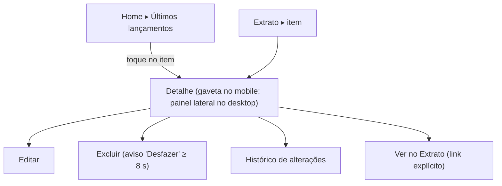

# FLUXO-013: Preferências (tema), navegação no desktop, detalhe da transação e polimento

- **Objetivo**: consistência entre dispositivos, ações visíveis e menos tropeços; tudo **sem alterar a meta de lançar em < 10 s**.
- **Rastreabilidade**: [NEED-022](../../stakeholder/needs/NEED-022-preferencias-de-uso-e-ergonomia.md) (RN-022.1, 022.2) · Histórias [US-036](../backlog/stories/US-036-detalhe-da-transacao-na-home.md), [US-037](../backlog/stories/US-037-tema-claro-escuro.md), [US-038](../backlog/stories/US-038-navegacao-desktop-conteudo-contido.md), [US-039](../backlog/stories/US-039-polimento-da-homologacao.md) · Q-F06 · D-PO-21, D-PO-22, D-PO-23, D-PO-24.

## 1. Detalhe da transação (US-036)



```text
┌───────────────────────────────┐
│ Mercado do bairro          ✕  │
│ R$ 150,50                     │
│ 10/10/2026 · Supermercado     │
│ Nubank Conjunta · Pago por Lucas │
│ Autor: Lucas · Só meu         │
│ [ Editar ] [ Excluir ] [ Histórico ] │   ← rotulados, não "…"
│ Ver no Extrato ›              │
└───────────────────────────────┘
```
Regras: transferência/acerto mostram "Desfazer" em vez de "Editar"; despesa gerada por baixa orienta "Use Desfazer pagamento"; compra no cartão mostra a fatura; um componente único para Home e Extrato.

## 2. Tema (US-037)
Menu do avatar ▸ **Aparência**: ( ) Sistema (padrão) ( ) Claro ( ) Escuro. Preferência por dispositivo; sem piscar; contraste AA e estados com texto.

## 3. Navegação no desktop (US-038): duas alternativas

| | **Opção B (adotada, Q-F06)** | Opção A (alternativa, para o usuário escolher se quiser) |
| :-- | :-- | :-- |
| Descrição | Menu superior mantido; **menu e conteúdo de 960 px centralizados** (≥ 1024 px) | **Barra inferior** também no desktop, de **largura contida e centralizada** |
| Vantagem | Convenção web; leitura confortável; menor risco | Consistência com o celular; botões agrupados ao alcance |
| Desvantagem | Navegação diferente do mobile | Barra inferior em tela larga é pouco convencional e ocupa a base do conteúdo |
| Custo | 2 pts | ~3 pts (mais teste de largura e rolagem) |
| "+" lançamento rápido | ancorado ao container | ancorado acima da barra |

```text
Opção B (≥ 1024 px)                          Mobile (< 1024 px)
┌───────────────────────────────────────┐    ┌──────────────┐
│   [Início][Extrato][Acerto][Cartões]… │    │   conteúdo   │
│      ┌───────────────────────────┐    │    │              │
│      │ conteúdo (máx. 960 px)    │ (+)│    │ [barra inferior]│
│      └───────────────────────────┘    │    └──────────────┘
└───────────────────────────────────────┘
```

## 4. Polimento da homologação (US-039)
- Erros de campo **somem ao corrigir**; espaço da mensagem reservado (sem salto de layout).
- **Configurações** no menu do avatar com **Categorias**, Tags (R3), Aparência, Família.
- Convite pendente: **Copiar link** e **Reenviar e-mail**; aviso "A pessoa precisa entrar com a conta Google do mesmo e-mail".
- Extrato: **Limpar filtros** (só com filtro ativo) e rótulos acessíveis nos selects.
- Telas de formulário de página inteira (ex.: regra de divisão) **não mostram o "+"**.

## 5. Histórico
- 2026-10-04 — Criado no refinamento da R2.1.
