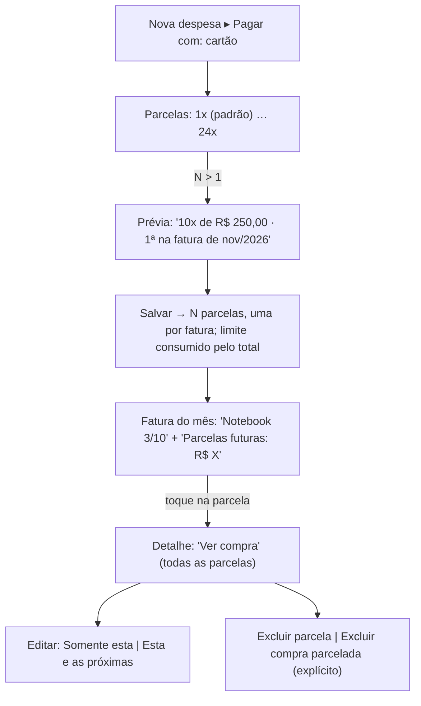
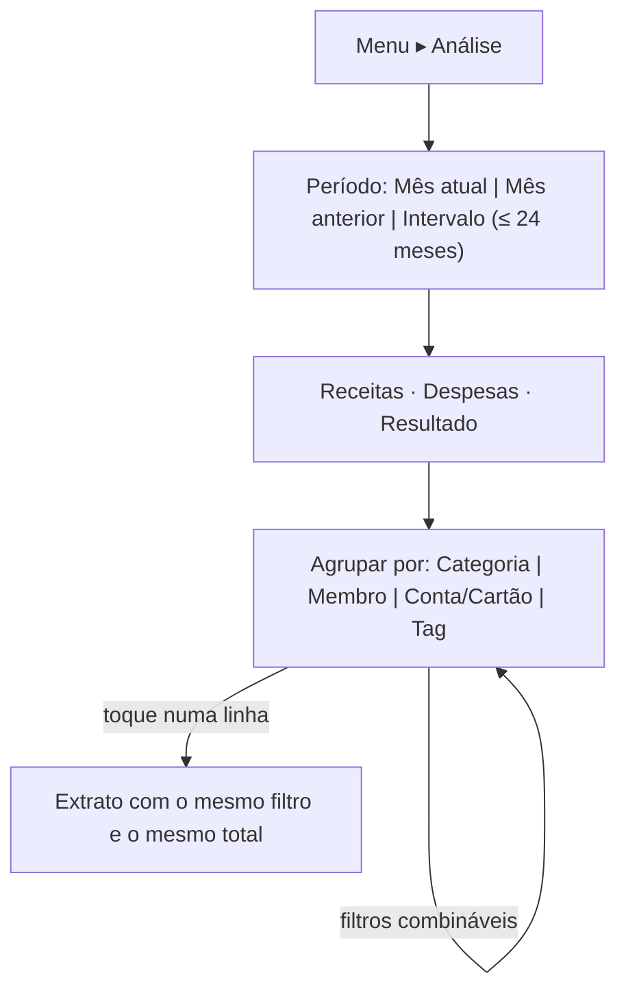

# FLUXO-014: Parcelamento no cartão, tags, análise sintética e cor por conta (R3)

- **Objetivo**: completar o dia a dia do cartão (compras parceladas) e responder "para onde foi o dinheiro?" com tags e visões simples.
- **Rastreabilidade**: [NEED-003](../../stakeholder/needs/NEED-003-cartoes-de-credito-e-parcelamentos.md), [NEED-013](../../stakeholder/needs/NEED-013-tags-livres.md), [NEED-016](../../stakeholder/needs/NEED-016-visoes-sinteticas-filtraveis.md), [NEED-017](../../stakeholder/needs/NEED-017-identificacao-visual-por-cor.md) · Histórias [US-040](../backlog/stories/US-040-compra-parcelada-no-cartao.md), [US-041](../backlog/stories/US-041-gerenciar-compra-parcelada.md), [US-042](../backlog/stories/US-042-parcelado-dividido-no-acerto-por-parcela.md), [US-045](../backlog/stories/US-045-tags-livres-no-lancamento.md), [US-046](../backlog/stories/US-046-gerenciar-tags.md), [US-047](../backlog/stories/US-047-filtrar-extrato-por-tag.md), [US-048](../backlog/stories/US-048-visao-sintetica-periodo-totais-e-categoria.md), [US-049](../backlog/stories/US-049-visao-sintetica-quebras-e-filtros.md), [US-050](../backlog/stories/US-050-cor-por-conta-e-cartao.md) · D-PO-25..D-PO-30.

## 1. Parcelamento



- Na fatura, cada parcela é uma linha "Descrição n/N"; **fatura fechada ou paga trava** a parcela.
- No Extrato: **uma linha por parcela**; "Ver compra" mostra o plano completo (parcelas, faturas e situação).
- Dividir (US-042): "As parcelas entram no acerto de cada mês".
- Limite: "Disponível R$ 2.500,00" cai pelo total; sobe a cada fatura paga.

## 2. Tags
```text
Lançamento: "+ Tag" (recolhido) ▸ [viagem-nordeste ×] [ferias ×]  digitar → sugestões
Configurações ▸ Tags:  viagem 5 lançamentos  ⋯ (Renomear, Mesclar, Remover)
Extrato ▸ Filtros ▸ Tag (seleção múltipla, qualquer das tags)
```
Regras visíveis: tags são da família; "Viagem" = "viagem"; mais de 3 gera aviso suave; transferência/acerto não têm tags.

## 3. Análise (visões sintéticas)



```text
┌─────────────────────────────────────────────┐
│ Análise     [ Out/2026 ▾ ]   Filtros ▾      │
│ Receitas R$ 5.000   Despesas R$ 1.200       │
│ Resultado R$ 3.800                          │
│ Agrupar por: (Categoria|Membro|Conta|Tag)   │
│ Supermercado       R$ 700,00   58,3%  ████▌ │
│ Lazer e restaurantes R$ 300,00 25,0%  ██▌   │
│ Moradia            R$ 200,00   16,7%  █▋    │
│ ⓘ Um lançamento com várias tags é contado   │
│   em cada uma (só ao agrupar por tag)       │
└─────────────────────────────────────────────┘
```
Escopo **fechado**: sem gráficos customizáveis, sem exportação, sem comparativos. Mesma fonte de números do Extrato e do Resumo do Mês.

## 4. Cor por conta/cartão
Ponto de cor + **nome sempre visível**; paleta de 10 cores nomeadas, atribuição automática (primeira cor não usada), editável em "Editar conta/cartão"; funciona nos temas claro e escuro.

## 5. Estados
Skeleton; vazio ("Nada lançado neste período", "Nenhuma tag ainda"); erro ("Não foi possível carregar a análise"); valores ocultos mascaram os totais e mantêm os percentuais.

## 6. Histórico
- 2026-10-04 — Criado no refinamento da R3.
