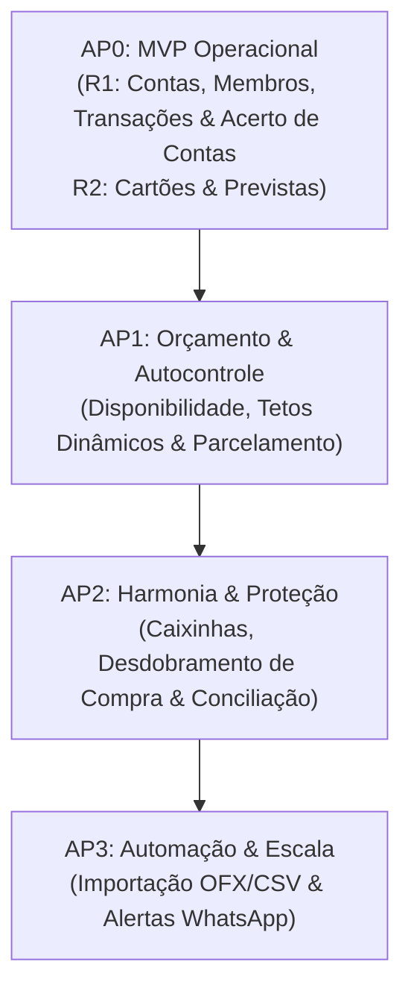

# 🗓️ Cronograma Estratégico de Releases e Priorização (Roadmap)

Este documento estabelece a priorização de negócio, divisão de releases (**AP0 / MVP**, **AP1**, **AP2** e **AP3**) e a esteira de entrega de valor para orientar o **Product Owner (PO)** no planejamento de Épicos e Sprints.

---

## 🎯 Filosofia de Priorização
A estratégia de lançamentos segue a **pirâmide de adoção financeira familiar**:
1. **AP0 (MVP Operacional):** Rastreabilidade básica (onde o dinheiro entra e sai) **e acerto de contas familiar (split, NEED-007)**, conforme o ADR-006 e a decisão D-GES-02 do Gestor.
2. **AP1 (Diferencial de Autocontrole):** Tetos orçamentários, disponibilidade por categoria e parcelamento futuro.
3. **AP2 (Maturidade & Harmonia Familiar):** Caixinhas de reserva, desdobramento de compras (split de compra), conciliação e termômetro de liquidez. *(O acerto de contas entre cônjuges, NEED-007, saiu do AP2 e está no AP0.)*
4. **AP3 (Automação & Conveniência):** Importação de arquivos e alertas externos.



---

## 🚀 Detalhamento das Releases

### 📦 Release AP0 (MVP - Fundação Operacional)
> **Meta de Negócio:** Permitir que a família comece a registrar todas as contas bancárias, cartões e movimentações diárias, sabendo exatamente quem gastou o quê **e quem deve quanto a quem**.

#### Fatiamento do AP0 em duas entregas (proposta do PO, ratificada pelo Gestor em D-GES-01)
| Entrega | Conteúdo (NEEDs) | Homologação de valor |
| :--- | :--- | :--- |
| **R1 — "Fechar o mês em casal"** (EN-001, US-001..013) | NEED-012, NEED-001, NEED-002, NEED-006 (extrato simples), **NEED-007 (split)** | **Sim, após a R1** (o Stakeholder valida a dor vital antes da R2) |
| **R2 — "AP0 completo"** (US-014..019) | NEED-003 fase 1 (cartão à vista; pagar fatura como *Should*, D-GES-04), NEED-004 fase 1 (previstas pontuais), gerenciar categorias | Ao final da R2 |

Do ponto de vista de negócio, o AP0 só se considera concluído com a R2; a R1 já entrega a dor vital inegociável (saber o gasto conjunto e o acerto entre o casal).

| Need Mapeado | Funcionalidades Entregues no AP0 | Valor para a Família |
| :--- | :--- | :--- |
| **[`NEED-012`](file:///home/arlan/ai-tests/finance-manager/agents/stakeholder/needs/NEED-012-autenticacao-social-google.md)** | Autenticação com 1 Clique via Conta Google e vínculo por e-mail ao grupo familiar. | Login seguro, sem fricção de senhas e com avatar/foto automática. |
| **[`NEED-001`](file:///home/arlan/ai-tests/finance-manager/agents/stakeholder/needs/NEED-001-membros-e-responsaveis.md)** | Cadastro de membros familiares e dupla responsabilidade inicial (`autor_cadastro` + `responsavel_gasto`). | Saber quem realizou cada despesa da casa. |
| **[`NEED-002`](file:///home/arlan/ai-tests/finance-manager/agents/stakeholder/needs/NEED-002-contas-bancarias-e-compartilhamento.md)** | Cadastro de contas bancárias, saldos reais, entradas, saídas avulsas e transferências entre contas. | Visão consolidada de quanto dinheiro a família tem no banco. |
| **[`NEED-003`](file:///home/arlan/ai-tests/finance-manager/agents/stakeholder/needs/NEED-003-cartoes-de-credito-e-parcelamentos.md)** | Cadastro de cartões de crédito (limite, fechamento e vencimento) e lançamento de compras à vista no cartão. | Separar gastos no cartão do saldo imediato da conta corrente. |
| **[`NEED-004`](file:///home/arlan/ai-tests/finance-manager/agents/stakeholder/needs/NEED-004-despesas-previstas-e-recorrentes.md)** | Lançamento manual de despesas previstas pontuais, estados `PREVISTO` vs `PAGO` e baixa em conta. | Não esquecer contas pontuais que vencem no mês. |
| **[`NEED-006`](file:///home/arlan/ai-tests/finance-manager/agents/stakeholder/needs/NEED-006-disponibilidade-e-relatorios.md)** | Extrato detalhado simples com filtros por conta, cartão, período e membro. | Consulta rápida de extrato unificado familiar. |
| **[`NEED-007`](file:///home/arlan/ai-tests/finance-manager/agents/stakeholder/needs/NEED-007-acerto-de-contas-familiar.md)** *(movida do AP2, ADR-006)* | **Acerto de Contas Familiar (Split):** regra de divisão (igualitária ou proporcional, com vigência por data), balanço do mês, compensação líquida sugerida e registro do acerto como transferência. Período = mês-calendário (D-PO-03). Entra na **R1**. | Eliminar atritos e discussões sobre quem pagou mais; é a dor vital do MVP. |

---

### 📦 Release AP1 (Orçamento, Previsibilidade & Autocontrole)
> **Meta de Negócio:** Entregar o grande diferencial da plataforma: responder em tempo real *"quanto ainda podemos gastar este mês?"* e projetar parcelamentos futuros.

| Need Mapeado | Funcionalidades Entregues no AP1 | Valor para a Família |
| :--- | :--- | :--- |
| **[`NEED-005`](file:///home/arlan/ai-tests/finance-manager/agents/stakeholder/needs/NEED-005-ciclo-e-tetos-orcamentarios.md)** | Ciclo orçamentário familiar customizável (dia de corte), tetos dinâmicos por categoria e **auto-clonagem** do mês anterior. | Orçamento adaptado à realidade familiar sem esforço de recadastro mensal. |
| **[`NEED-006`](file:///home/arlan/ai-tests/finance-manager/agents/stakeholder/needs/NEED-006-disponibilidade-e-relatorios.md)** | **Painel Central de Disponibilidade:** Exibição do saldo disponível por categoria com termômetro visual (verde/amarelo/vermelho). | Autocontrole familiar consciente sem bloqueios burocráticos. |
| **[`NEED-003`](file:///home/arlan/ai-tests/finance-manager/agents/stakeholder/needs/NEED-003-cartoes-de-credito-e-parcelamentos.md)** | Compras parceladas no cartão com projeção automática nas faturas dos meses subsequentes (ex: 1/10, 2/10...). | Clareza do comprometimento de renda nos próximos meses. |
| **[`NEED-004`](file:///home/arlan/ai-tests/finance-manager/agents/stakeholder/needs/NEED-004-despesas-previstas-e-recorrentes.md)** | Despesas recorrentes mensais automáticas (contas fixas que já nascem previstas nos meses futuros). | Previsão financeira sem digitação repetitiva todo mês. |
| **[`NEED-001`](file:///home/arlan/ai-tests/finance-manager/agents/stakeholder/needs/NEED-001-membros-e-responsaveis.md)** | Indicação explícita do `responsavel_pagamento` nas despesas previstas. | Saber com clareza quem é o responsável por quitar cada boleto. |

---

### 📦 Release AP2 (Maturidade & Harmonia Familiar)
> **Meta de Negócio:** Refinamento avançado para blindar o patrimônio da família e garantir precisão nos saldos. *(O acerto de contas entre cônjuges, NEED-007, foi antecipado para o AP0/R1.)*

| Need Mapeado | Funcionalidades Entregues no AP2 | Valor para a Família |
| :--- | :--- | :--- |
| **[`NEED-009`](file:///home/arlan/ai-tests/finance-manager/agents/stakeholder/needs/NEED-009-caixinhas-e-saldo-livre.md)** | **Caixinhas de Reserva no detalhe da conta** e exibição **estrita do Saldo Livre para Gastar** na tela principal. | Proteger o dinheiro da reserva de emergência e férias de ser gasto por engano. |
| **[`NEED-008`](file:///home/arlan/ai-tests/finance-manager/agents/stakeholder/needs/NEED-008-desdobramento-de-despesas.md)** | **Desdobramento de Despesa Única:** Ratear compras de hipermercado/farmácia em múltiplas categorias e responsáveis. | Tetos orçamentários limpos e precisão total no rateio de compras mistas. |
| **[`NEED-010`](file:///home/arlan/ai-tests/finance-manager/agents/stakeholder/needs/NEED-010-conciliacao-e-auditoria-de-ajustes.md)** | **Conciliação Rápida de Saldo** com indicador visível de auditoria de desvios por conta. | Ajustar saldos com 1 clique e vigiar hábitos de despesas não registradas. |
| **[`NEED-011`](file:///home/arlan/ai-tests/finance-manager/agents/stakeholder/needs/NEED-011-termometro-de-liquidez-imediata.md)** | **Termômetro de Liquidez Imediata (7 Dias):** Alerta preventivo de contas a vencer contra saldo livre disponível. | Evitar cheque especial e multas por descasamento de fluxo de caixa. |

---

### 📦 Release AP3 (Automação, Conveniência & Escala)
> **Meta de Negócio:** Reduzir a fricção manual e conectar o sistema a canais externos do dia a dia.

| Funcionalidade | Descrição |
| :--- | :--- |
| **Importação OFX / CSV** | Carga de arquivos de extrato bancário e faturas de cartão com conciliação inteligente. |
| **Notificações via WhatsApp / Telegram** | Lembretes matinais de boletos que vencem no dia e aviso quando uma categoria entrar em alerta vermelho. |
| **Metas com Prazo & Progresso** | Estipular data limite e barra de progresso nas caixinhas de reserva com cálculo de aporte mensal sugerido. |

---

## 📊 Matriz de Dependência e Entrega para o PO

```text
[AP0 - MVP Operacional]
   ├── R1 - Fechar o mês em casal (EN-001, US-001..013)
   │    ├── Épico 0: Autenticação Google & Onboarding Familiar (NEED-012)
   │    ├── Épico 1: Governança Familiar & Membros (NEED-001)
   │    ├── Épico 2: Gestão de Contas & Movimentações (NEED-002)
   │    └── Épico 10: Acerto de Contas entre Membros / Split (NEED-007)  <- antecipado do AP2 (ADR-006)
   └── R2 - AP0 completo (US-014..019)
        ├── Épico 3: Cartões de Crédito Básicos (NEED-003 - Fase 1)
        └── Épico 4: Despesas Previstas Pontuais (NEED-004 - Fase 1)

[AP1 - Orçamento & Autocontrole]
   ├── Épico 5: Ciclo Orçamentário & Tetos Dinâmicos com Auto-Clonagem (NEED-005)
   ├── Épico 6: Painel Central de Saldo Disponível por Categoria (NEED-006)
   ├── Épico 7: Compras Parceladas no Cartão (NEED-003 - Fase 2)
   └── Épico 8: Recorrência Automática de Despesas (NEED-004 - Fase 2)

[AP2 - Maturidade & Harmonia Familiar]
   ├── Épico 9: Caixinhas Protegidas & Saldo Livre (NEED-009)
   ├── Épico 11: Desdobramento de Compras Mistas (NEED-008)
   ├── Épico 12: Conciliação Rápida & Auditoria de Ajustes (NEED-010)
   └── Épico 13: Termômetro de Liquidez dos Próximos 7 Dias (NEED-011)

[AP3 - Automação & Escala]
   ├── Épico 14: Importação de Extratos OFX e Faturas CSV
   └── Épico 15: Notificações e Alertas Externos (WhatsApp/Telegram)
```
