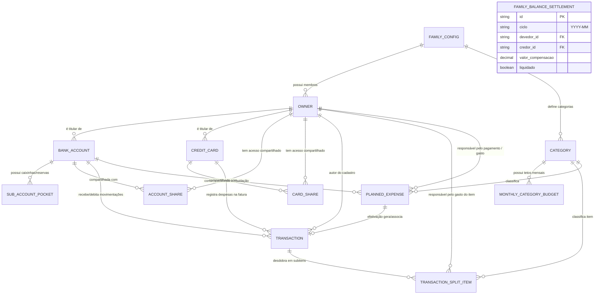

# 📦 Catálogo de Necessidades de Negócio (Needs)

Este diretório contém o levantamento detalhado das necessidades de negócio identificadas pelo **Stakeholder** para a plataforma de **Gestão Financeira Familiar**.

Cada documento `NEED-XXX` serve como **insumo direto** para o **Product Owner (PO)** redigir os Épicos e Histórias de Usuário (`US-XXX`) e para o **Arquiteto de Software** orientar decisões técnicas (`ADR-XXX`).

---

## 🗺️ Matriz de Rastreabilidade de Necessidades

| ID | Título da Necessidade | Área de Negócio | Status | Próximo Passo PO |
| :--- | :--- | :--- | :--- | :--- |
| **[`NEED-001`](file:///home/arlan/ai-tests/finance-manager/agents/stakeholder/needs/NEED-001-membros-e-responsaveis.md)** | Membros da Família e Matriz de Responsabilidade | Governança & Usuários | ✅ Validado | Histórias de cadastro de membros e tripla atribuição |
| **[`NEED-002`](file:///home/arlan/ai-tests/finance-manager/agents/stakeholder/needs/NEED-002-contas-bancarias-e-compartilhamento.md)** | Contas Bancárias e Compartilhamento Familiar | Meios Financeiros | ✅ Validado | Histórias de gestão de contas e transferências |
| **[`NEED-003`](file:///home/arlan/ai-tests/finance-manager/agents/stakeholder/needs/NEED-003-cartoes-de-credito-e-parcelamentos.md)** | Cartões de Crédito e Compras Parceladas | Meios de Pagamento | ✅ Validado | Histórias de ciclo da fatura e parcelamento futuro |
| **[`NEED-004`](file:///home/arlan/ai-tests/finance-manager/agents/stakeholder/needs/NEED-004-despesas-previstas-e-recorrentes.md)** | Despesas Previstas, Recorrência e Quitação | Planejamento Futuro | ✅ Validado | Histórias de compromissos previstos e baixa |
| **[`NEED-005`](file:///home/arlan/ai-tests/finance-manager/agents/stakeholder/needs/NEED-005-ciclo-e-tetos-orcamentarios.md)** | Ciclo Orçamentário, Tetos Mensais e Auto-Clonagem | Orçamento Familiar | ✅ Validado | Histórias de ciclo familiar, tetos e cópia automática |
| **[`NEED-006`](file:///home/arlan/ai-tests/finance-manager/agents/stakeholder/needs/NEED-006-disponibilidade-e-relatorios.md)** | Painel de Disponibilidade por Categoria e Relatórios | Visualização & Decisão | ✅ Validado | Histórias do painel de autocontrole e extratos |
| **[`NEED-007`](file:///home/arlan/ai-tests/finance-manager/agents/stakeholder/needs/NEED-007-acerto-de-contas-familiar.md)** | Acerto de Contas entre Membros (Split Familiar) | Rateio Familiar | ✅ Validado | Histórias de cálculo de compensação entre cônjuges |
| **[`NEED-008`](file:///home/arlan/ai-tests/finance-manager/agents/stakeholder/needs/NEED-008-desdobramento-de-despesas.md)** | Desdobramento de Despesa Única (Split de Compra) | Lançamentos & Precisão | ✅ Validado | Histórias de rateio por categoria e responsável |
| **[`NEED-009`](file:///home/arlan/ai-tests/finance-manager/agents/stakeholder/needs/NEED-009-caixinhas-e-saldo-livre.md)** | Caixinhas (Reservas) e Saldo Livre para Gastar | Blindagem Patrimonial | ✅ Validado | Histórias de subcontas e exibição do saldo livre |
| **[`NEED-010`](file:///home/arlan/ai-tests/finance-manager/agents/stakeholder/needs/NEED-010-conciliacao-e-auditoria-de-ajustes.md)** | Conciliação Rápida de Saldo e Auditoria de Ajustes | Integridade & Controle | ✅ Validado | Histórias de ajuste de saldo e indicador de desvios |
| **[`NEED-011`](file:///home/arlan/ai-tests/finance-manager/agents/stakeholder/needs/NEED-011-termometro-de-liquidez-imediata.md)** | Termômetro de Liquidez Imediata (Janela de 7 Dias) | Prevenção de Caixa | ✅ Validado | Histórias do card de cobertura imediata de contas |
| **[`NEED-012`](file:///home/arlan/ai-tests/finance-manager/agents/stakeholder/needs/NEED-012-autenticacao-social-google.md)** | Autenticação via Conta Google e Acesso Familiar | Segurança & Onboarding | ✅ Validado (AP0) | Histórias de Sign-in with Google e perfil familiar |

---

## 📐 Modelo Conceitual Consolidado

O relacionamento entre as necessidades de negócio acima é representado pelo modelo de entidades a seguir:

