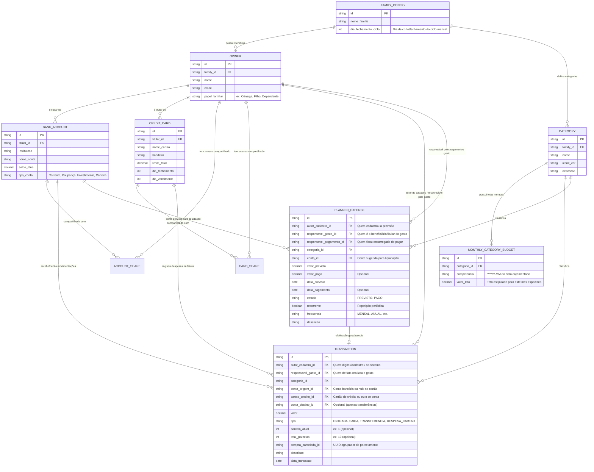

# Requisitos de Negócio & Funcionalidades - Stakeholder

> [!NOTE]
> Este documento é uma **visão consolidada** de todos os requisitos de negócio.
> Para o trabalho do **Product Owner** e **Arquiteto**, utilize os documentos modulares e rastreáveis na pasta [`needs/`](file:///home/arlan/ai-tests/finance-manager/agents/stakeholder/needs/), com códigos de rastreabilidade de `NEED-001` a `NEED-006`.

---

## 1. Entidades Principais

---

## 2. Requisitos Funcionais (RF)

### 2.1. Configuração do Grupo Familiar e Ciclo Orçamentário
- **RF01 - Configuração do Ciclo Orçamentário:** Permitir cadastrar o dia base de corte/fechamento do ciclo orçamentário da família (ex: dia 01 a 30/31, ou dia 05 a 04 do mês seguinte).
- **RF02 - Cadastro de Membros da Família (Owners):** Cadastro dos membros participantes com identificação clara de papéis familiares.

### 2.2. Matriz de Responsabilidade nos Lançamentos
- **RF03 - Tripla Responsabilidade nos Registros:**
  - **Autor do Cadastro:** Gravado compulsoriamente com o membro logado (auditoria de quem alimentou o sistema).
  - **Responsável pelo Gasto:** Campo explícito indicando quem realizou o gasto ou de quem é a receita (permite que um membro registre compras feitas por outros).
  - **Responsável pelo Pagamento:** Em despesas previstas, identificar qual membro é o encarregado de efetuar a liquidação financeira no vencimento.

### 2.3. Gestão de Contas Bancárias e Compartilhamento
- **RF04 - Cadastro de Contas Bancárias:** Identificação de instituição, titular principal, saldo inicial e tipo.
- **RF05 - Compartilhamento Familiar de Contas:** Contas bancárias podem ter acesso concedido a múltiplos membros da família para visibilidade de extrato e lançamentos compartilhados.
- **RF06 - Saldo em Tempo Real:** Atualização dinâmica a cada entrada, saída avulsa, transferência ou pagamento baixado.

### 2.4. Gestão de Cartões de Crédito e Compras Parceladas
- **RF07 - Cadastro de Cartões de Crédito:** Entidade autônoma contendo titular, limite total, dia de fechamento e dia de vencimento.
- **RF08 - Compartilhamento Familiar de Cartões:** Cartões podem ser compartilhados entre os membros para lançamentos de despesas.
- **RF09 - Lançamento de Despesas em Cartão:** Registrar gastos no cartão com identificação do responsável pela compra.
- **RF10 - Compras Parceladas no Cartão:**
  - O usuário informa o valor total (ou da parcela) e o número de parcelas (ex: 10x).
  - O sistema projeta automaticamente as parcelas futuras (`1/10`, `2/10`, ..., `10/10`) nas faturas dos meses subsequentes, respeitando a data de fechamento.
- **RF11 - Ciclo da Fatura do Cartão:** Despesas reduzem o limite disponível, mas não debitam o saldo bancário de imediato. A fatura consolidada gera uma despesa a ser paga no vencimento via conta bancária.

### 2.5. Categorias e Tetos Orçamentários Dinâmicos por Mês
- **RF12 - Categorização de Gastos:** Atribuição de categorias a todas as transações, previsões e gastos no cartão.
- **RF13 - Tetos Orçamentários Flexíveis por Mês/Competência:**
  - O teto **não é estático** na categoria. A cada mês/ciclo, a família pode definir tetos diferentes para acomodar flutuações sazonais (ex: teto maior de lazer em Dezembro, teto maior de educação em Janeiro).
- **RF14 - Preservação do Histórico Orçamentário:**
  - O sistema preserva o registro histórico de quanto foi orçado/projetado para cada categoria em cada mês anterior, permitindo avaliar a evolução e comparar o planejado vs realizado.

### 2.6. Movimentações Financeiras e Fluxo de Caixa
- **RF15 - Entradas:** Registro de receitas informando o membro recebedor e a conta bancária.
- **RF16 - Saídas Avulsas:** Débitos diretos na conta bancária.
- **RF17 - Transferências entre Contas:** Movimentações internas com débito na origem e crédito no destino simultâneos.

### 2.7. Planejamento de Gastos & Despesas Recorrentes
- **RF18 - Despesas Previstas:** Lançamento de compromissos futuros com data prevista, valor estimado, categoria e indicação de quem vai pagar.
- **RF19 - Despesas Recorrentes:** Possibilidade de marcar uma despesa como recorrente (mensal), gerando as projeções nos meses futuros automaticamente.
- **RF20 - Transição de Estado (`PREVISTO` -> `PAGO`):** Ao quitar o compromisso, o sistema baixa a previsão para `PAGO`, registra a data efetiva, valor final pago e a conta bancária debitada.

---

## 3. Visões e Relatórios

### 3.1. Visão Central Familiar: Saldo Disponível por Categoria
- **RF21 - Painel Central de Tetos e Disponibilidade (Foco em Autocontrole):**
  - **Foco Primário:** A visão principal familiar responde: *"Quanto ainda temos disponível para gastar nesta categoria este mês?"*.
  - Exibição em tempo real de: **Teto Estipulado do Mês**, **Gasto Acumulado** e **Saldo Restante Disponível**.
  - **Alertas Estritamente Visuais:** Termômetro visual de consumo (verde, amarelo, vermelho) para estimular a conscientização e autocontrole dos membros, sem bloquear lançamentos.

### 3.2. Visões Sintéticas Complementares
- **RF22 - Painel Sintético por Conta e Cartão:** Saldos consolidados, patrimônio líquido em contas e limites de cartões.
- **RF23 - Painel Sintético por Membro (Divisão Familiar):** Total gasto por quem realizou o gasto, total pago por quem quitou e saldo de participação de cada membro.
- **RF24 - Painel de Previsões:** Comparativo de compromissos `PREVISTO` pendentes vs `PAGO` no mês corrente.

### 3.3. Visões Detalhadas (Analítico e Extratos)
- **RF25 - Extrato Mensal Multidimensional:** Movimentações completas com filtros por membro (autor ou responsável pelo gasto), conta, cartão, categoria, status e período.
- **RF26 - Detalhamento de Fatura do Cartão:** Visualização analítica da fatura discriminando cada compra e respectivo membro que gastou.
- **RF27 - Histórico Comparativo de Orçamento:** Relatório comparando teto projetado vs realizado mês a mês por categoria.

### 3.4. Governança, Proteção e Conciliação
- **RF28 - Acerto de Contas entre Membros (Split Familiar):** Cálculo do balanço de despesas comuns entre membros com apontamento da transferência líquida de compensação ("quem transfere para quem").
- **RF29 - Desdobramento de Despesa Única (Split de Compra):** Rateio de uma mesma compra em múltiplos subitens com categorias e membros responsáveis distintos.
- **RF30 - Caixinhas de Reserva & Saldo Livre:**
  - Na tela principal/home, exibir **estritamente o Saldo Livre para Gastar** das contas bancárias.
  - Caixinhas visíveis apenas no detalhe da conta, com transferências internas conta ⇄ caixinha como contas separadas.
- **RF31 - Conciliação Rápida e Auditoria de Desvios:**
  - Ajuste rápido digitando o saldo real do banco, gerando transação de conciliação.
  - Indicador e histórico de auditoria por conta para acompanhar o volume de conciliações realizadas.
- **RF32 - Termômetro de Liquidez Imediata (7 Dias):** Card no topo do painel monitorando despesas previstas dos próximos 7 dias vs saldo livre para prevenir descasamento de caixa.

---

## 4. Roadmap de Alimentação de Dados
- **Fase 1 (MVP - Foco Imediato):** Alimentação 100% manual com formulários ágeis e intuitivos para os membros da família.
- **Fase 2 (Evolução Prioritária - To-Do Futuro):** Importação semi-automática de extratos bancários e faturas de cartão via arquivos **OFX** e **CSV**.
- **Fase 3 (Expansão Futura):** Notificações e lembretes via WhatsApp/Telegram e metas de caixinhas com prazo e progresso.

---

## 5. Regras de Negócio (RN)
- **RN01 - Responsabilidade Clara:** Nenhuma movimentação é salva sem `autor_cadastro` (usuário da sessão) e `responsavel_gasto` (membro apontado).
- **RN02 - Pagador Designado:** Em despesas previstas, o `responsavel_pagamento` identifica quem é o encarregado operacional de liquidar a conta até o vencimento.
- **RN03 - Comportamento das Parcelas:** As parcelas de compras parceladas são imutáveis em lote ou editáveis individualmente com aviso de impacto nas faturas futuras.
- **RN04 - Alerta Visual Não-Bloqueante:** Ultrapassar o teto orçamentário de uma categoria altera a sinalização visual para destaque vermelho/alerta, sem travar novos lançamentos. A responsabilidade do controle é dos próprios usuários.
- **RN05 - Independência de Saldo no Cartão:** Gastos de cartão consomem limite, mas só afetam o saldo bancário no momento do pagamento da fatura consolidada.
- **RN06 - Clonagem Automática de Teto:** Ao abrir um novo ciclo orçamentário, o sistema copia compulsoriamente os valores do mês anterior como padrão inicial, permitindo livre alteração pontual.
- **RN07 - Imutabilidade de Tetos Encerrados:** Alterações de teto para o mês atual ou futuro não afetam o registro histórico de tetos de meses já finalizados.
- **RN08 - Saldo Livre Restritivo na Home:** O saldo exibido na Home é sempre descontado das caixinhas protegidas.
- **RN09 - Integridade de Rateio:** A soma dos subitens de uma compra desdobrada deve coincidir exatamente com o valor total da transação.
- **RN10 - Isolamento de Conciliação:** Lançamentos de ajuste de conciliação não impactam tetos de categorias de consumo comuns.

---

## 6. Revisão pós-homologação R1+R2 (2026-10-04) — feedback do usuário

Novos requisitos de negócio, detalhados em [`needs/`](needs/) e priorizados em [`parecer-feedback-usuario.md`](parecer-feedback-usuario.md):

- **RF33 - Tags livres** em lançamentos, complementares às categorias (NEED-013).
- **RF34 - Ocultar valores** na tela, por dispositivo (NEED-014).
- **RF35 - Resumo do Mês** como foco da Início: receitas, despesas, resultado, a pagar e saldo previsto; saldos em card recolhível (NEED-015).
- **RF36 - Visões sintéticas filtráveis** por período, conta/cartão, categoria, tag e membro (NEED-016; amplia RF22/RF23).
- **RF37 - Cor por conta/cartão** (NEED-017).
- **RF38 - Divisão opcional** (padrão "Só meu") e **definida no lançamento**, com percentual gravado (NEED-018; ajusta RF28).
- **RF39 - Acerto de contas opcional** por família e discreto na Início (NEED-019; ajusta RF28).
- **RF40 - Ciclo de vida de cadastros:** editar família, remover membro (ex-membro), sair, arquivar/excluir conta e cartão (NEED-020).
- **RF41 - Compras parceladas no cartão** antecipadas para a R3 (RF10, NEED-003 revisado).
- **RN11 - Percentual gravado por lançamento:** mudar a regra da família nunca recalcula lançamentos existentes.
- **RN12 - Resumo do Mês:** despesas por competência; "a pagar" por caixa; pagamento de fatura, transferência e acerto não são despesa; números reconciliam com o Extrato.
- **RN13 - Histórico é sagrado:** remover membro ou arquivar conta nunca apaga lançamentos, acertos ou faturas.
- **RN14 - Privacidade por padrão:** valores começam ocultos em dispositivo novo.
- **Futuro:** grupos não familiares e múltiplos grupos (NEED-021); assistente de IA (NEED-023).
