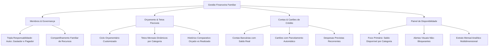

# Visão Geral do Produto - Stakeholder

## 1. Contexto de Negócio
No contexto da **Gestão Financeira Familiar**, a tomada de decisão muitas vezes é prejudicada pela dispersão das informações entre membros da família (cônjuges, filhos, dependentes), contas bancárias e cartões de crédito.

A principal dor não é apenas saber "quanto dinheiro tem no banco", mas sim responder com clareza: **"Quanto ainda podemos gastar este mês em cada área da nossa vida sem estourar o orçamento?"**.

---

## 2. Proposta de Valor & Filosofia do Produto
- **Autonomia & Responsabilidade Consciente:** O sistema não bloqueia operações arbitrariamente; ele empodera os membros da família através de **alertas visuais claros** e transparência sobre o saldo restante disponível por categoria.
- **Flexibilidade Orçamentária Real:** A vida financeira familiar muda mês a mês (férias, volta às aulas, datas festivas). Os tetos de gastos não são estáticos: a família pode ajustá-los dinamicamente a cada ciclo, mantendo histórico para aprendizado.
- **Rastreabilidade Tripla sem Fricção:** Saber quem digitou, quem realizou o gasto e quem é encarregado de efetuar o pagamento.
- **Independência da Fatura do Cartão:** Gestão autônoma de cartões e compras parceladas sem comprometer a leitura do saldo bancário imediato.

---

## 3. Pilares Fundamentais do Sistema

---

## 4. Próximos Passos Estratégicos
1. Consumo deste material pelo **Product Owner (PO)** para decomposição em Épicos e Histórias de Usuário.
2. Análise pelo **Arquiteto** para desenhar o modelo de dados e a arquitetura técnica correspondente.
