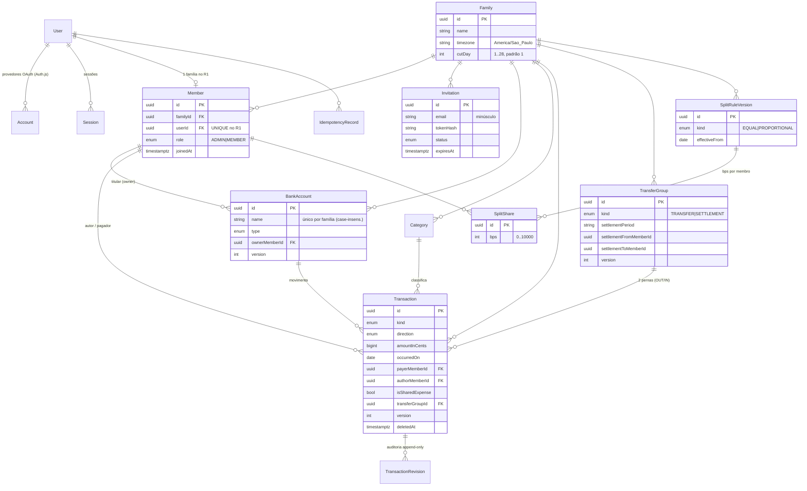

# Modelo de Dados Consolidado (R1)

*Responsável: Agente Tech Lead · 2026-10-04 · Referências: [ADR-007](../adrs/ADR-007-modelo-de-ledger-e-correcoes.md), [ADR-009](../adrs/ADR-009-idempotencia-e-controle-otimista.md), [ADR-010](../adrs/ADR-010-periodo-e-datas.md), [ADR-011](../adrs/ADR-011-regra-de-divisao-versionada.md), [ADR-012](../adrs/ADR-012-convites-e-email.md), [ADR-013](../adrs/ADR-013-isolamento-por-familia.md).*
*Substitui o diagrama de classes preliminar de `overview.md`. Cobre EN-001 e US-001..013. Fora do R1 (cartões, previstas, orçamento) **não** entra aqui.*

## 1. Diagrama ER



## 2. Convenções
- IDs `uuid` (`@default(uuid()) @db.Uuid`). Tabelas em `snake_case` via `@@map`; campos em `camelCase` no Prisma.
- Datas contábeis `@db.Date`; eventos `@db.Timestamptz(3)`.
- Dinheiro `BigInt` (centavos), convertido com `toCents()` na borda (SDD-000 §3).
- Os modelos do Auth.js mantêm os nomes que o adaptador Prisma espera (`User`, `Account`, `Session`, `VerificationToken`). Para evitar colisão, a **conta bancária chama-se `BankAccount`** (tabela `bank_accounts`); nos contratos de API o campo continua `accountId`.
- Todas as tabelas de domínio têm `familyId` e **`@@unique([familyId, id])`** para permitir FKs compostas (ADR-013).

## 3. Schema Prisma proposto (trechos normativos)

> O Dev gera a migração a partir disto, ajustando sintaxe à versão instalada. **Normativo:** nomes de campos/enums, tipos, `@unique`/índices, FKs compostas e os `CHECK`/índices parciais da §4. O `SystemInfo` do EN-001 permanece.

```prisma
generator client { provider = "prisma-client"; output = "../src/generated/prisma" }
datasource db { provider = "postgresql" }

enum Role              { ADMIN MEMBER }
enum InvitationStatus  { PENDING ACCEPTED CANCELED EXPIRED }
enum BankAccountType   { CHECKING SAVINGS CASH }
enum CategoryKind      { EXPENSE INCOME }
enum TransactionKind   { EXPENSE INCOME OPENING TRANSFER_OUT TRANSFER_IN }
enum Direction         { CREDIT DEBIT }
enum DeletionReason    { DELETED UNDONE }
enum TransferGroupKind { TRANSFER SETTLEMENT }
enum SplitKind         { EQUAL PROPORTIONAL }
enum RevisionAction    { CREATE UPDATE DELETE RESTORE UNDO }
enum EmailStatus       { SENT FAILED }

// ───────── Auth.js (adaptador Prisma) ─────────
model User {
  id            String    @id @default(uuid()) @db.Uuid
  name          String?
  email         String    @unique            // SEMPRE minúsculo (normalizado no adaptador)
  emailVerified DateTime? @db.Timestamptz(3)
  image         String?
  createdAt     DateTime  @default(now()) @db.Timestamptz(3)
  accounts      Account[]
  sessions      Session[]
  member        Member?
  idempotency   IdempotencyRecord[]
  @@map("users")
}
model Account {                               // modelo do Auth.js (NÃO é a conta bancária)
  id                String  @id @default(uuid()) @db.Uuid
  userId            String  @db.Uuid
  type              String
  provider          String
  providerAccountId String
  refresh_token     String?
  access_token      String?
  expires_at        Int?
  token_type        String?
  scope             String?
  id_token          String?
  session_state     String?
  user User @relation(fields: [userId], references: [id], onDelete: Cascade)
  @@unique([provider, providerAccountId])
  @@map("accounts")
}
model Session {
  id           String   @id @default(uuid()) @db.Uuid
  sessionToken String   @unique
  userId       String   @db.Uuid
  expires      DateTime @db.Timestamptz(3)
  user User @relation(fields: [userId], references: [id], onDelete: Cascade)
  @@index([userId])
  @@map("sessions")
}
model VerificationToken {
  identifier String
  token      String   @unique
  expires    DateTime @db.Timestamptz(3)
  @@unique([identifier, token])
  @@map("verification_tokens")
}

// ───────── Núcleo familiar ─────────
model Family {
  id        String   @id @default(uuid()) @db.Uuid
  name      String
  timezone  String   @default("America/Sao_Paulo")
  currency  String   @default("BRL")
  cutDay    Int      @default(1)                // CHECK 1..28; sem UI no R1 (ADR-010)
  createdAt DateTime @default(now()) @db.Timestamptz(3)
  members      Member[]
  invitations  Invitation[]
  bankAccounts BankAccount[]
  categories   Category[]
  transactions Transaction[]
  transferGroups TransferGroup[]
  splitRules   SplitRuleVersion[]
  @@map("families")
}
model Member {
  id       String   @id @default(uuid()) @db.Uuid
  familyId String   @db.Uuid
  userId   String   @db.Uuid
  role     Role
  joinedAt DateTime @default(now()) @db.Timestamptz(3)
  family Family @relation(fields: [familyId], references: [id])
  user   User   @relation(fields: [userId], references: [id])
  @@unique([userId])                            // R1: 1 família por usuário (relaxar por migração se N famílias)
  @@unique([familyId, userId])
  @@unique([familyId, id])
  @@map("members")
}
model Invitation {
  id               String           @id @default(uuid()) @db.Uuid
  familyId         String           @db.Uuid
  email            String                              // minúsculo
  role             Role             @default(MEMBER)
  tokenHash        String           @unique            // sha256(token) em hex
  status           InvitationStatus @default(PENDING)
  expiresAt        DateTime         @db.Timestamptz(3)
  invitedByMemberId String          @db.Uuid
  emailStatus      EmailStatus
  createdAt        DateTime         @default(now()) @db.Timestamptz(3)
  acceptedAt       DateTime?        @db.Timestamptz(3)
  acceptedByUserId String?          @db.Uuid
  canceledAt       DateTime?        @db.Timestamptz(3)
  family Family @relation(fields: [familyId], references: [id])
  @@index([familyId, status])
  @@index([email, status])
  @@map("invitations")                        // + índice único parcial (familyId, email) WHERE status='PENDING' (§4)
}

// ───────── Contas, categorias, movimentações ─────────
model BankAccount {
  id            String          @id @default(uuid()) @db.Uuid
  familyId      String          @db.Uuid
  name          String                               // trim; único por família ignorando caixa (§4)
  institution   String
  type          BankAccountType
  ownerMemberId String          @db.Uuid
  version       Int             @default(1)
  createdAt     DateTime        @default(now()) @db.Timestamptz(3)
  updatedAt     DateTime        @updatedAt @db.Timestamptz(3)
  family       Family @relation(fields: [familyId], references: [id])
  owner        Member @relation(fields: [familyId, ownerMemberId], references: [familyId, id])
  transactions Transaction[]
  @@unique([familyId, id])
  @@map("bank_accounts")
}
model Category {
  id        String       @id @default(uuid()) @db.Uuid
  familyId  String       @db.Uuid
  name      String
  kind      CategoryKind
  icon      String                                   // chave de ícone (ex.: "shopping-cart") ou emoji
  sortOrder Int
  archivedAt DateTime?   @db.Timestamptz(3)          // uso futuro (US-014)
  family Family @relation(fields: [familyId], references: [id])
  transactions Transaction[]
  @@unique([familyId, kind, name])
  @@unique([familyId, id])
  @@map("categories")
}
model TransferGroup {
  id                     String            @id @default(uuid()) @db.Uuid
  familyId               String            @db.Uuid
  kind                   TransferGroupKind
  occurredOn             DateTime          @db.Date
  settlementPeriod       String?                       // "YYYY-MM" (kind=SETTLEMENT)
  settlementFromMemberId String?           @db.Uuid    // devedor
  settlementToMemberId   String?           @db.Uuid    // credor
  authorMemberId         String            @db.Uuid
  version                Int               @default(1)
  createdAt              DateTime          @default(now()) @db.Timestamptz(3)
  deletedAt              DateTime?         @db.Timestamptz(3)   // desfeito
  deletedByMemberId      String?           @db.Uuid
  family Family @relation(fields: [familyId], references: [id])
  legs   Transaction[]
  @@unique([familyId, id])
  @@index([familyId, kind, settlementPeriod])
  @@map("transfer_groups")
}
model Transaction {
  id                String          @id @default(uuid()) @db.Uuid
  familyId          String          @db.Uuid
  kind              TransactionKind
  direction         Direction
  accountId         String          @db.Uuid
  amountInCents     BigInt                              // magnitude (>0; OPENING pode ser 0)
  occurredOn        DateTime        @db.Date
  categoryId        String?         @db.Uuid            // EXPENSE/INCOME: obrigatório; demais: nulo
  description       String                              // 2..100; padrão = nome da categoria; transferências: texto gerado
  note              String?                             // até 500
  payerMemberId     String?         @db.Uuid            // EXPENSE/INCOME: quem pagou/recebeu (D-PO-01); demais: nulo
  isSharedExpense   Boolean         @default(false)     // true só em EXPENSE comum
  authorMemberId    String          @db.Uuid            // imutável
  updatedByMemberId String?         @db.Uuid
  transferGroupId   String?         @db.Uuid
  version           Int             @default(1)
  createdAt         DateTime        @default(now()) @db.Timestamptz(3)
  updatedAt         DateTime        @updatedAt @db.Timestamptz(3)
  deletedAt         DateTime?       @db.Timestamptz(3)
  deletedByMemberId String?         @db.Uuid
  deletionReason    DeletionReason?

  family   Family        @relation(fields: [familyId], references: [id])
  account  BankAccount   @relation(fields: [familyId, accountId], references: [familyId, id])
  category Category?     @relation(fields: [familyId, categoryId], references: [familyId, id])
  payer    Member?       @relation("TxPayer",  fields: [familyId, payerMemberId], references: [familyId, id])
  author   Member        @relation("TxAuthor", fields: [familyId, authorMemberId], references: [familyId, id])
  group    TransferGroup? @relation(fields: [familyId, transferGroupId], references: [familyId, id])
  revisions TransactionRevision[]

  @@unique([familyId, id])
  @@index([familyId, occurredOn(sort: Desc), createdAt(sort: Desc), id(sort: Desc)])
  @@index([familyId, accountId])
  @@index([familyId, payerMemberId, occurredOn])
  @@index([familyId, kind, occurredOn])
  @@map("transactions")                        // + CHECKs e índice único parcial (§4)
}
model TransactionRevision {                    // append-only (trigger, §4)
  id            String         @id @default(uuid()) @db.Uuid
  familyId      String         @db.Uuid
  transactionId String         @db.Uuid
  revision      Int                              // = version resultante
  action        RevisionAction
  actorMemberId String         @db.Uuid
  at            DateTime       @default(now()) @db.Timestamptz(3)
  changes       Json                             // [{ field, from, to }]; CREATE: snapshot em "to"
  transaction Transaction @relation(fields: [transactionId], references: [id])
  @@unique([transactionId, revision, action])
  @@index([familyId, transactionId, at])
  @@map("transaction_revisions")
}

// ───────── Divisão (SDD-002) ─────────
model SplitRuleVersion {
  id              String    @id @default(uuid()) @db.Uuid
  familyId        String    @db.Uuid
  kind            SplitKind
  effectiveFrom   DateTime  @db.Date
  createdByMemberId String? @db.Uuid
  createdAt       DateTime  @default(now()) @db.Timestamptz(3)
  family Family @relation(fields: [familyId], references: [id])
  shares SplitShare[]
  @@index([familyId, effectiveFrom(sort: Desc), createdAt(sort: Desc)])
  @@map("split_rule_versions")
}
model SplitShare {
  id       String @id @default(uuid()) @db.Uuid
  ruleId   String @db.Uuid
  memberId String @db.Uuid
  bps      Int                                  // 0..10000
  rule SplitRuleVersion @relation(fields: [ruleId], references: [id], onDelete: Cascade)
  @@unique([ruleId, memberId])
  @@map("split_shares")
}

// ───────── Infra ─────────
model IdempotencyRecord {
  id             String   @id @default(uuid()) @db.Uuid
  userId         String   @db.Uuid
  key            String
  method         String
  path           String
  requestHash    String
  responseStatus Int
  responseBody   Json
  createdAt      DateTime @default(now()) @db.Timestamptz(3)
  user User @relation(fields: [userId], references: [id], onDelete: Cascade)
  @@unique([userId, key])
  @@index([createdAt])
  @@map("idempotency_records")
}
```

## 4. Migração em SQL cru (CHECKs, índices parciais, triggers) — obrigatória

```sql
-- Família
ALTER TABLE families ADD CONSTRAINT families_cut_day_chk CHECK ("cutDay" BETWEEN 1 AND 28);

-- Conta: nome único por família, sem distinguir caixa/espaços nas pontas
CREATE UNIQUE INDEX bank_accounts_family_name_uq ON bank_accounts ("familyId", lower(btrim(name)));

-- Convite: no máximo um PENDENTE por (família, e-mail)
CREATE UNIQUE INDEX invitations_pending_uq ON invitations ("familyId", email) WHERE status = 'PENDING';

-- Transação: invariantes do ledger (ADR-007)
ALTER TABLE transactions ADD CONSTRAINT tx_amount_chk CHECK (
  ("amountInCents" > 0) OR (kind = 'OPENING' AND "amountInCents" >= 0));
ALTER TABLE transactions ADD CONSTRAINT tx_kind_shape_chk CHECK (
  (kind = 'EXPENSE'      AND direction = 'DEBIT'  AND "categoryId" IS NOT NULL AND "payerMemberId" IS NOT NULL AND "transferGroupId" IS NULL)
  OR (kind = 'INCOME'    AND direction = 'CREDIT' AND "categoryId" IS NOT NULL AND "payerMemberId" IS NOT NULL AND "isSharedExpense" = false AND "transferGroupId" IS NULL)
  OR (kind = 'OPENING'   AND "categoryId" IS NULL AND "payerMemberId" IS NULL AND "isSharedExpense" = false AND "transferGroupId" IS NULL)
  OR (kind = 'TRANSFER_OUT' AND direction = 'DEBIT'  AND "categoryId" IS NULL AND "payerMemberId" IS NULL AND "isSharedExpense" = false AND "transferGroupId" IS NOT NULL)
  OR (kind = 'TRANSFER_IN'  AND direction = 'CREDIT' AND "categoryId" IS NULL AND "payerMemberId" IS NULL AND "isSharedExpense" = false AND "transferGroupId" IS NOT NULL));
ALTER TABLE transactions ADD CONSTRAINT tx_deleted_chk CHECK (
  ("deletedAt" IS NULL AND "deletedByMemberId" IS NULL AND "deletionReason" IS NULL)
  OR ("deletedAt" IS NOT NULL AND "deletedByMemberId" IS NOT NULL AND "deletionReason" IS NOT NULL));
-- Exatamente uma perna de cada tipo por transferência
CREATE UNIQUE INDEX tx_transfer_leg_uq ON transactions ("transferGroupId", kind) WHERE "transferGroupId" IS NOT NULL;

-- Auditoria append-only
CREATE FUNCTION forbid_mutation() RETURNS trigger LANGUAGE plpgsql AS
$$ BEGIN RAISE EXCEPTION 'tabela % é append-only', TG_TABLE_NAME; END $$;
CREATE TRIGGER transaction_revisions_append_only
  BEFORE UPDATE OR DELETE ON transaction_revisions FOR EACH ROW EXECUTE FUNCTION forbid_mutation();
-- Hard delete de movimentação proibido
CREATE TRIGGER transactions_no_delete BEFORE DELETE ON transactions FOR EACH ROW EXECUTE FUNCTION forbid_mutation();

-- Divisão
ALTER TABLE split_shares ADD CONSTRAINT split_bps_chk CHECK (bps BETWEEN 0 AND 10000);
```
Observação: a soma de `bps` = 10000 por versão é validada no serviço (SDD-002) e verificada por teste de integração; não por `CHECK` (soma entre linhas).

## 5. Consultas-chave (referência de índice/SQL)
- **Saldo por conta:** `SELECT "accountId", SUM(CASE direction WHEN 'CREDIT' THEN "amountInCents" ELSE -"amountInCents" END) FROM transactions WHERE "familyId" = $1 AND "deletedAt" IS NULL GROUP BY "accountId"` (usar `$queryRaw`, converter `numeric` → `number` com asserção).
- **Totais receita/despesa do filtro:** idem, restrito a `kind IN ('EXPENSE','INCOME')` (SDD-005).
- **Despesas comuns do período:** `kind='EXPENSE' AND "isSharedExpense" AND "deletedAt" IS NULL AND "occurredOn" BETWEEN $start AND $end` (SDD-002).

## 6. Seed e migrações
Uma migração por história (`us-001-auth`, `us-002-familia`, …), nunca editar migração aplicada. O baseline `SystemInfo` do EN-001 permanece. Catálogo de categorias padrão em `src/modules/familia/default-categories.ts` (SDD-003 §4.3).
