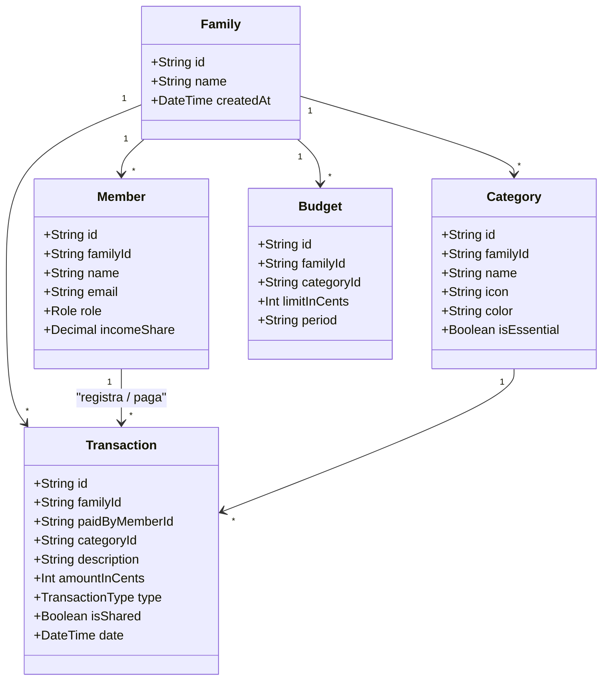

# 📐 Visão Arquitetural Preliminar (Tech Lead)

*Status: Parcialmente substituído — o modelo de dados vigente está em [`modelo-de-dados.md`](modelo-de-dados.md) (nomes `isSharedExpense`, `payerMemberId`, `authorMemberId`; ver ADR-007). O diagrama de classes abaixo é conceitual e preliminar.*  
*Responsável: Agente Tech Lead*

---

## 🏛️ Modelo de Domínio Familiar

O sistema financeiro familiar difere de um gerenciador pessoal tradicional porque deve acomodar múltiplos membros com papéis e visões financeiras distintas:

---

## 🔒 Princípios de Segurança e Integridade
1. **Multi-tenancy Estrito**: Nenhuma consulta pode retornar dados sem o filtro explícito de `familyId`.
2. **Cálculo Monetário Inteiro**: Armazenamento de moedas em centavos (`amountInCents: Integer`) para erradicar imprecisões de arredondamento IEEE 754.
3. **Auditoria de Ações**: Registro de quem criou, editou ou deletou cada transação.
